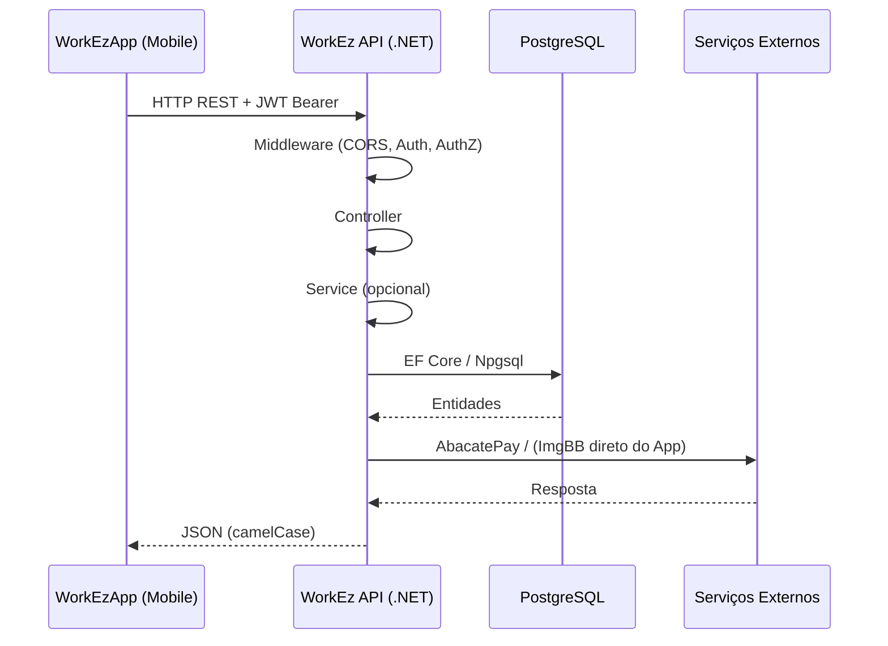
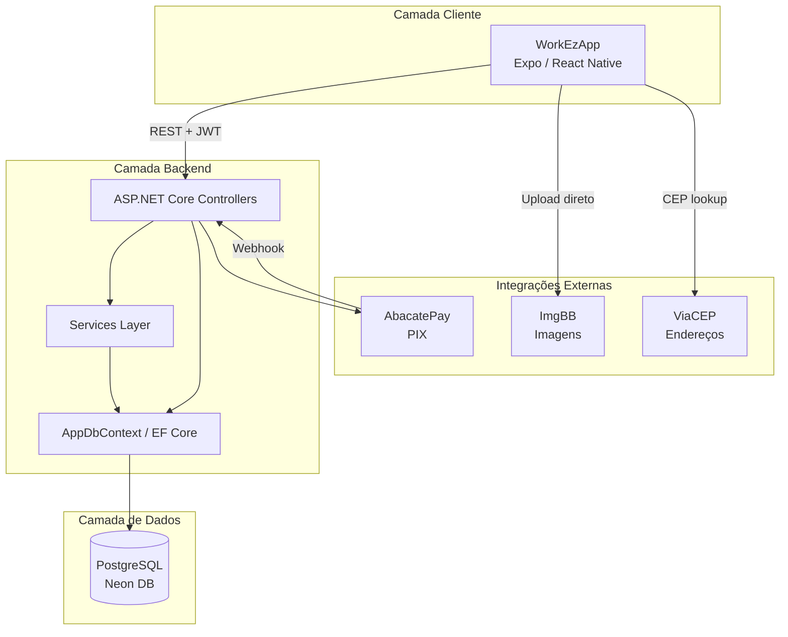
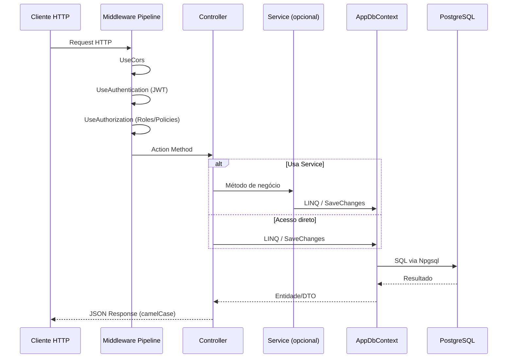
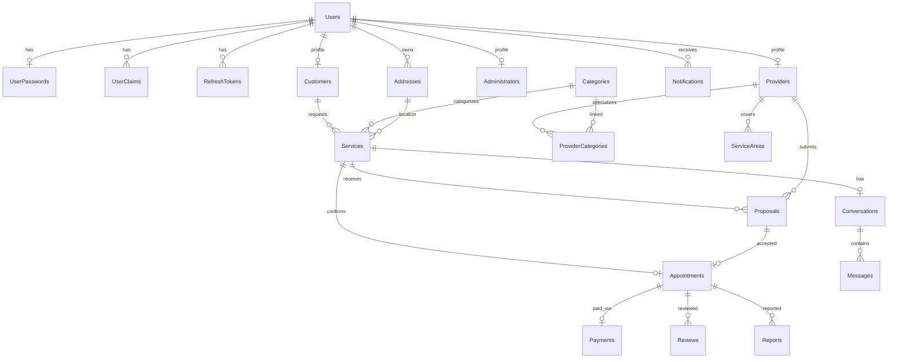
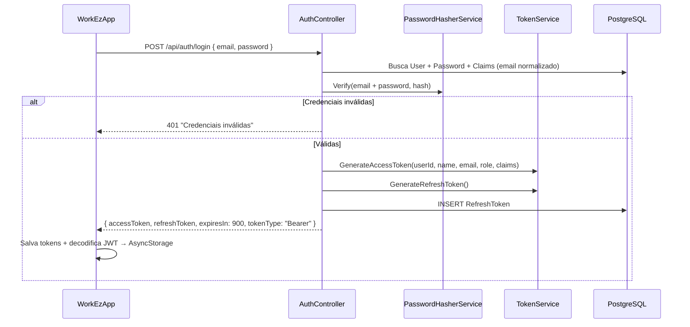
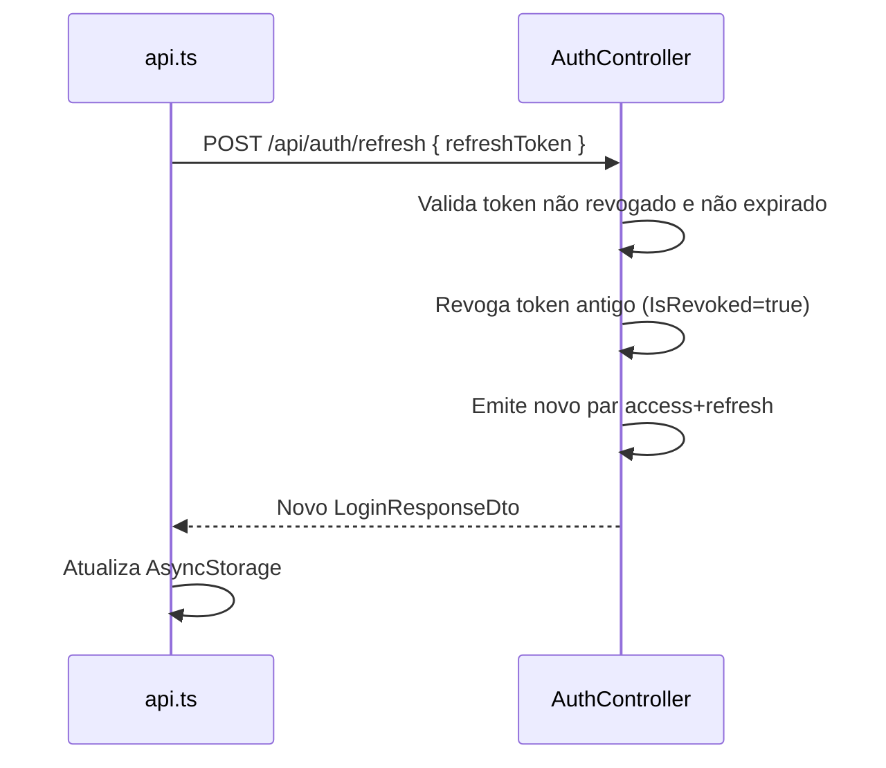
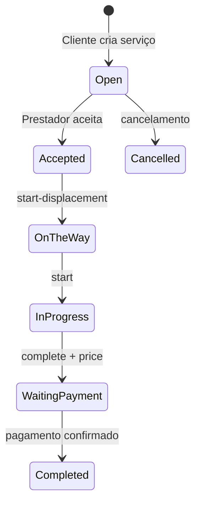
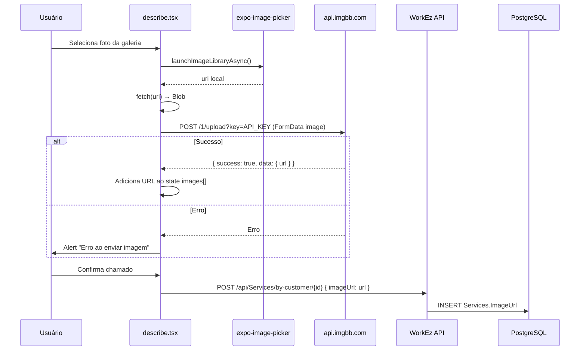
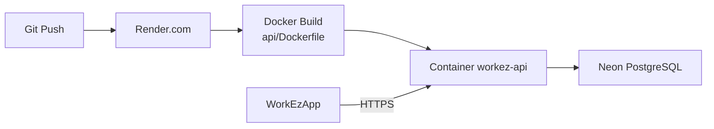
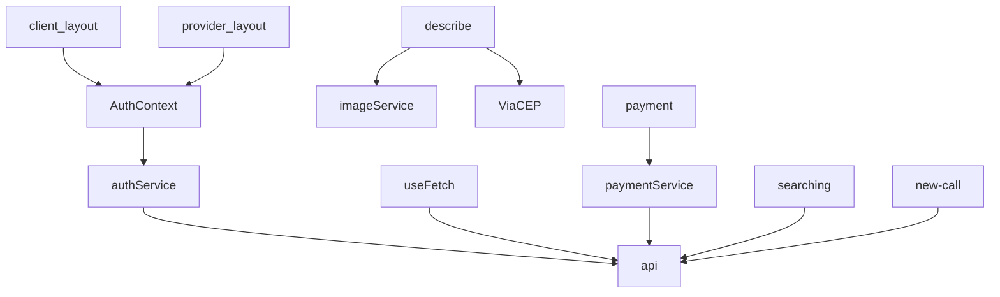

# WorkEz — Documentação Técnica Completa

**Versão do documento:** 1.0  
**Data:** 12 de junho de 2026  
**Repositório:** `D:\Dev\WorkEz`  
**Stack:** .NET 10 (API) + React Native / Expo 54 (Mobile) + PostgreSQL  

---

## Índice

1. [Visão Geral do Sistema](#1-visão-geral-do-sistema)
2. [Arquitetura Geral](#2-arquitetura-geral)
3. [Arquitetura do Frontend](#3-arquitetura-do-frontend)
4. [Arquitetura do Backend](#4-arquitetura-do-backend)
5. [Banco de Dados](#5-banco-de-dados)
6. [Sistema de Autenticação](#6-sistema-de-autenticação)
7. [Fluxos de Negócio](#7-fluxos-de-negócio)
8. [Fluxo de Upload de Imagens](#8-fluxo-de-upload-de-imagens)
9. [APIs](#9-apis)
10. [Integrações Externas](#10-integrações-externas)
11. [Segurança](#11-segurança)
12. [Infraestrutura](#12-infraestrutura)
13. [Dependências do Projeto](#13-dependências-do-projeto)
14. [Mapeamento Completo de Código](#14-mapeamento-completo-de-código)
15. [Melhorias Recomendadas](#15-melhorias-recomendadas)

---

## 1. Visão Geral do Sistema

### Nome da aplicação

**WorkEz** — Plataforma Multifuncional de Serviços

### Objetivo do sistema

Conectar **clientes** que precisam de serviços domésticos e profissionais (encanador, eletricista, diarista, etc.) a **prestadores de serviço** qualificados, gerenciando todo o ciclo de vida do chamado: abertura, aceite, execução, pagamento via PIX e avaliação pós-serviço.

### Problema que resolve

- Dificuldade de encontrar profissionais confiáveis para serviços pontuais ou urgentes.
- Falta de rastreabilidade do status do serviço (deslocamento, execução, pagamento).
- Ausência de um canal centralizado para pagamento seguro (PIX) com comissão da plataforma.

### Público-alvo

| Persona | Descrição |
|---------|-----------|
| **Cliente (Customer)** | Pessoa física que solicita serviços em sua residência ou estabelecimento |
| **Prestador (ServiceProvider)** | Profissional autônomo ou MEI que oferece serviços em categorias cadastradas |
| **Administrador (Admin)** | Operador da plataforma que gerencia categorias, usuários e denúncias |

### Principais funcionalidades

| Área | Funcionalidades |
|------|-----------------|
| **Autenticação** | Registro, login, logout, refresh token, recuperação de senha |
| **Cliente** | Solicitar serviço ("Chamar agora"), descrever problema, anexar fotos, acompanhar status, pagar via PIX, avaliar prestador |
| **Prestador** | Cadastro, definir categorias/área de atuação, ver oportunidades, aceitar chamados, executar serviço, informar valor, carteira de ganhos |
| **Pagamentos** | Integração AbacatePay (PIX), webhook, polling de status, carteira com comissão de 15% |
| **Comunicação** | Conversas e mensagens por serviço (API implementada; UI parcial) |
| **Moderação** | Avaliações, denúncias (reports), notificações |
| **Administração** | Gestão de categorias, usuários, agendamentos, denúncias |

### Regras de negócio de alto nível

1. Um **serviço** (`Service`) é criado pelo cliente com status `Open` e fica visível a prestadores cuja categoria coincida.
2. O prestador **aceita** o chamado diretamente (`POST /api/services/{id}/accept`), criando automaticamente uma **proposta aceita** e um **agendamento** (`Appointment`).
3. O ciclo de status do serviço segue: `Open` → `Accepted` → `OnTheWay` → `InProgress` → `WaitingPayment` → `Completed`.
4. O valor final é informado pelo prestador na conclusão (`PATCH /complete?price=`).
5. O cliente paga via **PIX** (AbacatePay); após confirmação, o serviço é marcado como `Completed`.
6. A plataforma retém **15% de comissão** sobre pagamentos confirmados (calculado na carteira do prestador).
7. Cada usuário possui um **papel único** (`Customer`, `ServiceProvider` ou `Admin`) determinado no registro.
8. Endereço exato pode ser mantido aproximado até o cliente liberar a localização (`LocationReleased`).

### Escopo do projeto

| Incluído | Não incluído / Parcial |
|----------|------------------------|
| API REST completa (.NET 10) | Painel web administrativo |
| App mobile Expo (Android/iOS) | Push notifications nativas |
| PostgreSQL + EF Core Migrations | Geolocalização real (nearby-services é placeholder) |
| JWT + Refresh Token | Envio de e-mail (reset de senha retorna token na API) |
| AbacatePay PIX | UI Admin no mobile |
| Upload de imagens via ImgBB | Proposta com negociação de preço (aceite direto com preço fixo R$ 150) |
| Swagger / OpenAPI | Testes automatizados completos (pasta referenciada no README, não analisada em profundidade) |

---

## 2. Arquitetura Geral

### Arquitetura utilizada

**Arquitetura Cliente-Servidor** com separação clara entre:

- **Frontend:** Aplicativo mobile React Native (Expo)
- **Backend:** API REST monolítica ASP.NET Core
- **Banco de dados:** PostgreSQL (Neon DB em produção)
- **Serviços externos:** AbacatePay (pagamentos), ImgBB (imagens), ViaCEP (endereços)

### Padrões arquiteturais adotados

| Padrão | Onde |
|--------|------|
| **Layered Architecture** | Controllers → Services → DbContext (Repositories implícitos via EF Core) |
| **Dependency Injection** | `Program.cs` — Singleton, Scoped, HttpClient tipado |
| **Repository-like** | Services encapsulam CRUD; alguns controllers acessam `AppDbContext` diretamente |
| **DTO Pattern** | Auth, Payment — demais endpoints usam entidades diretamente |
| **JWT Bearer Authentication** | Stateless access token + stateful refresh token |
| **File-based Routing** | Expo Router no frontend |
| **Context API** | `AuthContext` para estado de autenticação global |

### Tipo de arquitetura backend

**Monolito modular** — uma única aplicação ASP.NET Core com controllers e services organizados por domínio (Auth, Services, Payments, etc.), sem microserviços.

### Separação Frontend e Backend

```
WorkEz/
├── api/           → Backend .NET 10 (porta 5065 local / Render em produção)
└── WorkEzApp/     → Frontend Expo (comunica via HTTPS REST)
```

O frontend **nunca** acessa o banco diretamente. Toda persistência passa pela API em `https://workez-api.onrender.com`.

### Fluxo de comunicação entre camadas



### Diagrama textual da arquitetura



### Dependências externas

| Serviço | Finalidade | Quem consome |
|---------|------------|--------------|
| **PostgreSQL (Neon)** | Persistência relacional | API |
| **AbacatePay** | Cobrança PIX, webhook | API |
| **ImgBB** | Hospedagem de imagens | App (direto) |
| **ViaCEP** | Autocompletar endereço por CEP | App (direto) |
| **Render.com** | Hospedagem da API | Infraestrutura |

---

## 3. Arquitetura do Frontend

### Tecnologias

| Categoria | Tecnologia | Versão |
|-----------|------------|--------|
| Framework | React Native | 0.81.5 |
| Meta-framework | Expo | ~54.0.33 |
| Roteamento | Expo Router | ~6.0.23 |
| Linguagem | TypeScript | ~5.9.2 |
| Estilização | NativeWind + TailwindCSS | 4.2.4 / 3.4.19 |
| Animações | React Native Reanimated | ~4.1.1 |
| Ícones | lucide-react-native, @expo/vector-icons | — |
| Imagens | expo-image, expo-image-picker | — |
| Storage | @react-native-async-storage/async-storage | ^3.0.2 |
| Navegação | @react-navigation/native (via Expo Router) | ^7.1.8 |

### Gerenciamento de estado

- **Sem Redux/Zustand/React Query**
- `AuthContext` — usuário autenticado global
- `useFetch` — dados de servidor por tela (sem cache compartilhado)
- `useState` local — formulários e UI

### Gerenciamento de rotas

**Expo Router** (file-based). Arquivos em `WorkEzApp/app/` mapeiam 1:1 para rotas URL.

**Root layout** (`app/_layout.tsx`):
- `SafeAreaProvider` + `AuthProvider`
- `<Stack screenOptions={{ headerShown: false }} />`

**Layouts protegidos:**
- `app/client/_layout.tsx` — exige `role === 'Customer'`
- `app/provider/_layout.tsx` — exige `role === 'ServiceProvider'` (exceto `/provider/signup`)

### Sistema de autenticação (frontend)

- Tokens JWT + Refresh Token em AsyncStorage
- Chaves: `@workez_access_token`, `@workez_refresh_token`, `@workez_user_profile`
- `authService.login()` decodifica JWT e persiste perfil
- `apiRequest()` renova token automaticamente em 401
- Logout revoga refresh token na API

### Sistema de permissões

| Role | Rotas permitidas | Guard |
|------|------------------|-------|
| `Customer` | `/client/*` | `client/_layout.tsx` |
| `ServiceProvider` | `/provider/*` | `provider/_layout.tsx` |
| `Admin` | Nenhuma UI dedicada | Login redireciona para `/client` |
| Anônimo | `/`, `/login`, `/signup`, onboarding | Sem guard |

---

### Estrutura de Pastas

```text
WorkEzApp/
├── app/                          # Telas (Expo Router) — 52 rotas
│   ├── _layout.tsx               # Layout raiz + AuthProvider
│   ├── index.tsx                 # Splash screen
│   ├── login.tsx, signup.tsx     # Autenticação
│   ├── profile-choice.tsx        # Escolha cliente/prestador
│   ├── onboarding.tsx            # Introdução (3 slides)
│   ├── client/                   # Área do cliente (22 telas)
│   │   ├── _layout.tsx           # Route guard + BottomNav
│   │   ├── index.tsx             # Home
│   │   ├── describe.tsx          # Descrever serviço
│   │   ├── searching.tsx         # Criar chamado na API
│   │   ├── tracking/[id].tsx     # Acompanhar status
│   │   ├── payment/[id].tsx      # Pagamento PIX
│   │   └── ...
│   └── provider/                 # Área do prestador (24 telas)
│       ├── _layout.tsx
│       ├── calls.tsx             # Oportunidades e chamados
│       ├── new-call/[id].tsx     # Aceitar chamado
│       ├── wallet.tsx            # Carteira
│       └── ...
├── components/                   # Componentes de negócio
│   ├── BottomNav.tsx
│   ├── Button.tsx, Input.tsx
│   ├── ProfessionalCard.tsx
│   ├── ServiceCard.tsx
│   ├── RatingCard.tsx
│   ├── Badge.tsx, Logo.tsx, Toast.tsx
│   └── ui/                       # ~40 primitivos estilo shadcn (maioria não usada)
├── contexts/
│   └── AuthContext.tsx           # Estado global de autenticação
├── hooks/
│   ├── useFetch.ts               # Hook principal de dados
│   ├── use-color-scheme.ts
│   └── use-theme-color.ts
├── services/
│   ├── api.ts                    # Cliente HTTP + refresh token
│   ├── authService.ts            # Login, registro, logout
│   ├── paymentService.ts         # PIX via API
│   ├── imageService.ts           # Upload ImgBB
│   └── storage.ts                # Wrapper AsyncStorage
├── constants/
│   └── theme.ts                  # Design tokens (WorkEzTheme)
├── global.css                      # Tailwind/NativeWind
├── tailwind.config.js
├── app.json                        # Config Expo
└── package.json
```

---

### Fluxo das Telas

#### Área pública

| Rota | Arquivo | Objetivo | APIs | Navegação |
|------|---------|----------|------|-----------|
| `/` | `index.tsx` | Splash 2.5s | — | → `/onboarding` |
| `/onboarding` | `onboarding.tsx` | Apresentação do app | — | → `/profile-choice` |
| `/profile-choice` | `profile-choice.tsx` | Escolher perfil | — | → `/signup` ou `/provider/signup` ou `/login` |
| `/login` | `login.tsx` | Autenticação | `POST /api/Auth/login` | → `/client` ou `/provider` conforme role |
| `/signup` | `signup.tsx` | Registro cliente | `POST /api/Auth/register/customer` | Auto-login → `/client` |
| `/help` | `help.tsx` | Suporte | — | — |

#### Cliente — fluxo principal "Chamar agora"

| Rota | Objetivo | Componentes | APIs | Estados |
|------|----------|-------------|------|---------|
| `/client` | Home com categorias | Button, categorias | `GET /api/Categories` | Lista de categorias |
| `/client/category` | Selecionar categoria | — | `GET /api/Categories` | categoryId |
| `/client/describe` | Descrever serviço + fotos + endereço | Input, Button, ImagePicker | ViaCEP, ImgBB | description, address, images[] |
| `/client/confirm` | Resumo antes de enviar | — | — | Params de navegação |
| `/client/searching` | Criar serviço na API | ActivityIndicator | `GET /api/Customers/by-user/{id}`, `POST /api/Services/by-customer/{id}` | loading |
| `/client/tracking/[id]` | Acompanhar status | — | `GET /api/Services/{id}` | status do serviço |
| `/client/payment/[id]` | Pagamento PIX | Button, WebBrowser | `GET /api/Services/{id}`, `POST /api/payments/{appointmentId}`, polling status | paymentId, paymentUrl |
| `/client/completed/[id]` | Serviço concluído | — | `GET /api/Services/{id}` | — |
| `/client/rating/[id]` | Avaliar prestador | — | `POST /api/Reviews/by-customer/{id}` | rating, comment |
| `/client/services` | Histórico | ServiceCard | `GET /api/Services/by-customer/{id}` | lista |
| `/client/profile` | Menu perfil | — | — | logout via AuthContext |
| `/client/edit-profile` | Editar perfil | Input | `PUT /api/Users/profile`, `GET /api/Customers/by-user/{id}` | form fields |

#### Prestador — fluxo principal

| Rota | Objetivo | APIs | Navegação |
|------|----------|------|-----------|
| `/provider/signup` | Registro | `POST /api/Auth/register/provider` | → `/provider/work-area` |
| `/provider/work-area` | Categorias de atuação | `GET /api/Categories`, `POST /api/ProviderCategories/...` | → `/provider` |
| `/provider/calls` | Oportunidades + aceitos | `GET /api/Services/opportunities-by-user/{id}`, `GET /api/Services/by-provider-user/{id}` | → `/provider/new-call/[id]` |
| `/provider/new-call/[id]` | Aceitar chamado | `GET /api/Services/{id}`, `POST /api/Services/{id}/accept` | → `/provider/accepted/[id]` |
| `/provider/accepted/[id]` | Iniciar deslocamento | `PATCH /api/Services/{id}/start-displacement` | → `/provider/in-progress/[id]` |
| `/provider/in-progress/[id]` | Iniciar serviço | `PATCH /api/Services/{id}/start` | → `/provider/inform-value/[id]` |
| `/provider/inform-value/[id]` | Informar preço | `PATCH /api/Services/{id}/complete?price=` | → `/provider/waiting-payment/[id]` |
| `/provider/wallet` | Carteira | `GET /api/Providers/{id}/wallet` | — |
| `/provider/profile` | Perfil | `GET /api/ServiceProviders/by-user/{id}` | logout |

---

### Componentes principais

#### `BottomNav` — `components/BottomNav.tsx`

| Prop | Tipo | Descrição |
|------|------|-----------|
| `type` | `'client' \| 'provider'` | Define tabs de navegação |

**Responsabilidade:** Barra inferior com 3–4 abas conforme o tipo de usuário.

**Estados internos:** pathname atual via `usePathname()`.

---

#### `Button` — `components/Button.tsx`

| Prop | Tipo | Default |
|------|------|---------|
| `variant` | `'primary' \| 'secondary' \| 'ghost'` | `'primary'` |
| `fullWidth` | `boolean` | — |
| `children` | `ReactNode` | — |

**Responsabilidade:** Botão estilizado reutilizável com variantes visuais.

---

#### `Input` — `components/Input.tsx`

| Prop | Tipo | Descrição |
|------|------|-----------|
| `label` | `string?` | Rótulo acima do campo |
| `error` | `string?` | Mensagem de erro |

**Responsabilidade:** Campo de texto com label e erro.

---

#### `ProfessionalCard` — `components/ProfessionalCard.tsx`

| Prop | Tipo |
|------|------|
| `name`, `photo?`, `rating`, `servicesCompleted`, `distance?`, `specialties[]`, `verified?`, `isFavorite?`, `onToggleFavorite?`, `onPress?` |

**Responsabilidade:** Card de exibição de prestador com favoritos.

---

#### `ServiceCard` — `components/ServiceCard.tsx`

| Prop | Tipo |
|------|------|
| `category`, `description`, `status`, `date`, `professional?`, `onClick?` |

**Responsabilidade:** Card de serviço no histórico.

---

#### `RatingCard` — `components/RatingCard.tsx`

| Prop | Tipo |
|------|------|
| `clientName`, `clientPhoto?`, `rating`, `comment`, `date`, `tags?[]` |

**Responsabilidade:** Exibir avaliação recebida.

---

#### `AuthContext` — `contexts/AuthContext.tsx`

**Exporta:** `useAuth()` com `{ user, isLoading, isAuthenticated, signIn, signOut, refreshUser }`

**Responsabilidade:** Prover estado de autenticação global; carrega perfil do AsyncStorage no boot.

---

## 4. Arquitetura do Backend

### Tecnologias

| Categoria | Tecnologia |
|-----------|------------|
| Linguagem | C# 12 |
| Framework | ASP.NET Core 10 (`net10.0`) |
| ORM | Entity Framework Core 10 |
| Banco de dados | PostgreSQL via Npgsql 10 |
| Cache | Não implementado |
| Filas | Não implementado |
| Auth | JWT Bearer + BCrypt |
| Documentação | Swashbuckle (Swagger) |
| Pagamentos | AbacatePay REST API |

### Estrutura de Pastas

```text
api/
├── Program.cs                    # Entry point, DI, pipeline, seed
├── WorkEz.Api.csproj
├── appsettings.json              # Config (secrets via env vars)
├── Dockerfile
├── docker-compose.yml
├── Controllers/                  # 17 controllers REST
├── Services/                     # 18 services + interfaces
├── Entities/                     # 20 entidades de domínio
├── Enums/                        # 16 enums
├── DTOs/                         # Objetos de transferência (auth, payment)
├── Data/
│   └── AppDbContext.cs           # DbContext + Fluent API
├── Migrations/                   # 3 migrations EF Core
├── Extensions/
│   └── ServiceCollectionExtensions.cs  # Swagger + JWT docs
└── Filters/
    └── AuthorizeCheckOperationFilter.cs
```

### Camadas

| Camada | Localização | Responsabilidade |
|--------|-------------|------------------|
| **Controllers** | `Controllers/*.cs` | Endpoints HTTP, validação básica, orquestração |
| **Services** | `Services/*.cs` | Regras de negócio e CRUD encapsulado |
| **Repositories** | Implícito via `AppDbContext` | Acesso a dados EF Core |
| **Models/Entities** | `Entities/*.cs` | Modelo de domínio |
| **Middlewares** | Built-in ASP.NET | CORS, Authentication, Authorization |
| **Validators** | ModelState + Data Annotations nos DTOs | Validação de entrada |
| **Helpers** | Métodos privados nos controllers | Mapeamento, tokens de reset |
| **Providers** | `TokenService`, `PasswordHasherService` | Geração JWT, hash BCrypt |
| **Filters** | `AuthorizeFilter` global, `AuthorizeCheckOperationFilter` | Auth default + Swagger |

### Fluxo de Requisição



**Pipeline em `Program.cs`:**

```
Swagger → SwaggerUI → CORS (AllowAll) → Authentication → Authorization → MapControllers
+ GET /health (anonymous)
```

**Filtro global:** Todos os controllers exigem autenticação por padrão (`AuthorizeFilter`). Actions marcadas com `[AllowAnonymous]` são exceção.

---

## 5. Banco de Dados

**SGBD:** PostgreSQL  
**ORM:** Entity Framework Core  
**DbContext:** `api/Data/AppDbContext.cs`  
**Migrations:**

1. `20260501194728_PostgresInitial`
2. `20260502215740_RemoveKeycloak`
3. `20260609230338_AddCoreEntities`

Enums são persistidos como **strings** no PostgreSQL.

---

### Modelo de Dados

#### Tabela `Users`

| Campo | Tipo | Restrições | Finalidade |
|-------|------|------------|------------|
| `Id` | UUID | PK, não gerado pelo DB | Identificador único |
| `Name` | VARCHAR(200) | NOT NULL | Nome de exibição |
| `Email` | VARCHAR(320) | NOT NULL, UNIQUE (`UX_User_Email`) | Login |
| `Phone` | VARCHAR(30) | NULL | Telefone |
| `DocumentNumber` | VARCHAR(20) | NULL | CPF/CNPJ |
| `ProfilePicture` | VARCHAR(500) | NULL | URL da foto |
| `Role` | VARCHAR(50) | NOT NULL | Customer / ServiceProvider / Admin |
| `AccountStatus` | VARCHAR(50) | NOT NULL | Active / Inactive / Blocked |
| `CreatedAt` | TIMESTAMP | — | Data de criação |
| `UpdatedAt` | TIMESTAMP | NOT NULL | Última atualização |

---

#### Tabela `UserPasswords`

| Campo | Tipo | Restrições |
|-------|------|------------|
| `Id` | UUID | PK |
| `UserId` | UUID | FK → Users, UNIQUE, CASCADE DELETE |
| `PasswordHash` | VARCHAR(100) | NOT NULL (BCrypt) |

Relacionamento **1:1** com `Users`.

---

#### Tabela `UserClaims`

| Campo | Tipo | Restrições |
|-------|------|------------|
| `Id` | UUID | PK |
| `UserId` | UUID | FK → Users, CASCADE DELETE |
| `ClaimValue` | VARCHAR(200) | NOT NULL |

Claims extras emitidos como `permission` no JWT.

---

#### Tabela `RefreshTokens`

| Campo | Tipo | Restrições |
|-------|------|------------|
| `Id` | UUID | PK |
| `UserId` | UUID | FK → Users |
| `Token` | VARCHAR(200) | NOT NULL, UNIQUE |
| `ExpiresAt` | TIMESTAMP | — |
| `CreatedAt` | TIMESTAMP | — |
| `IsRevoked` | BOOLEAN | — |

---

#### Tabela `Customers`

| Campo | Tipo | Restrições |
|-------|------|------------|
| `Id` | UUID | PK |
| `UserId` | UUID | FK → Users, UNIQUE |
| `Notes` | VARCHAR(1000) | NULL |

---

#### Tabela `Providers` (ServiceProvider)

| Campo | Tipo | Restrições |
|-------|------|------------|
| `Id` | UUID | PK |
| `UserId` | UUID | FK → Users, UNIQUE |
| `ProfessionalDescription` | VARCHAR(2000) | NULL |
| `DocumentVerified` | BOOLEAN | DEFAULT false |
| `AverageRating` | DECIMAL(3,2) | DEFAULT 0 |
| `CompletedServicesCount` | INT | DEFAULT 0 |
| `AvailabilityStatus` | VARCHAR(50) | Available, etc. |

---

#### Tabela `Administrators`

| Campo | Tipo | Restrições |
|-------|------|------------|
| `Id` | UUID | PK |
| `UserId` | UUID | FK → Users, UNIQUE |
| `Role` | VARCHAR(100) | NULL |
| `AccessLevel` | VARCHAR(50) | NOT NULL |

---

#### Tabela `Categories`

| Campo | Tipo | Restrições |
|-------|------|------------|
| `Id` | UUID | PK |
| `Name` | VARCHAR(100) | NOT NULL, UNIQUE |
| `Description` | VARCHAR(500) | NULL |
| `Status` | VARCHAR(50) | Active / Inactive |

**Seed inicial:** Encanador, Eletricista, Diarista, Pintor, Montador, Técnico geral.

---

#### Tabela `ProviderCategories`

| Campo | Tipo | Restrições |
|-------|------|------------|
| `Id` | UUID | PK |
| `ProviderId` | UUID | FK → Providers |
| `CategoryId` | UUID | FK → Categories |
| `Status` | VARCHAR(50) | — |

**Índice único:** `(ProviderId, CategoryId)`.

---

#### Tabela `Addresses`

| Campo | Tipo | Restrições |
|-------|------|------------|
| `Id` | UUID | PK |
| `UserId` | UUID | FK → Users |
| `ZipCode` | VARCHAR(10) | NOT NULL |
| `Street` | VARCHAR(300) | NOT NULL |
| `Number` | VARCHAR(20) | NOT NULL |
| `Complement` | VARCHAR(200) | NULL |
| `Neighborhood` | VARCHAR(200) | NOT NULL |
| `City` | VARCHAR(200) | NOT NULL |
| `State` | VARCHAR(2) | NOT NULL |
| `Latitude`, `Longitude` | DOUBLE | NULL |
| `AddressType` | VARCHAR(50) | Home, Work, etc. |

---

#### Tabela `ServiceAreas`

| Campo | Tipo | Restrições |
|-------|------|------------|
| `Id` | UUID | PK |
| `ProviderId` | UUID | FK → Providers |
| `City` | VARCHAR(200) | NOT NULL |
| `State` | VARCHAR(2) | NOT NULL |
| `Neighborhood` | VARCHAR(200) | NULL |
| `Status` | VARCHAR(50) | — |

---

#### Tabela `Services`

| Campo | Tipo | Restrições |
|-------|------|------------|
| `Id` | UUID | PK |
| `CustomerId` | UUID | FK → Customers (Restrict) |
| `CategoryId` | UUID | FK → Categories (Restrict) |
| `AddressId` | UUID | FK → Addresses (Restrict) |
| `Title` | VARCHAR(300) | NOT NULL |
| `Description` | VARCHAR(3000) | NULL |
| `ImageUrl` | VARCHAR(1000) | NULL — URL ImgBB |
| `DesiredDate` | TIMESTAMP | NULL |
| `UrgencyLevel` | VARCHAR(50) | Low, Medium, High |
| `ServiceStatus` | VARCHAR(50) | Ciclo de vida |
| `ApproximateLatitude/Longitude` | DOUBLE | NULL |
| `LocationReleased` | BOOLEAN | DEFAULT false |
| `CreatedAt`, `UpdatedAt` | TIMESTAMP | — |

---

#### Tabela `Proposals`

| Campo | Tipo | Restrições |
|-------|------|------------|
| `Id` | UUID | PK |
| `ServiceId` | UUID | FK → Services (Cascade) |
| `ProviderId` | UUID | FK → Providers (Restrict) |
| `ProposedPrice` | DECIMAL(10,2) | NOT NULL |
| `Description` | VARCHAR(2000) | NULL |
| `EstimatedTime` | VARCHAR(100) | NULL |
| `ProposalStatus` | VARCHAR(50) | Pending, Accepted, Rejected, Cancelled |
| `CreatedAt`, `UpdatedAt` | TIMESTAMP | — |

---

#### Tabela `Appointments`

| Campo | Tipo | Restrições |
|-------|------|------------|
| `Id` | UUID | PK |
| `ServiceId` | UUID | FK, UNIQUE |
| `ProposalId` | UUID | FK, UNIQUE |
| `CustomerId` | UUID | FK → Customers |
| `ProviderId` | UUID | FK → Providers |
| `AppointmentStatus` | VARCHAR(50) | Confirmed, InProgress, Completed, Cancelled |
| `FinalPrice` | DECIMAL(10,2) | NOT NULL |
| `ScheduledDate` | TIMESTAMP | — |
| `CompletedAt` | TIMESTAMP | NULL |
| `ConfirmationCode` | VARCHAR(20) | NULL |
| `CreatedAt`, `UpdatedAt` | TIMESTAMP | — |

---

#### Tabela `Payments`

| Campo | Tipo | Restrições |
|-------|------|------------|
| `Id` | UUID | PK |
| `AppointmentId` | UUID | FK, UNIQUE |
| `AbacatePayPaymentId` | VARCHAR(200) | NULL |
| `ExternalId` | VARCHAR(200) | NULL |
| `PaymentUrl` | VARCHAR(1000) | NULL |
| `ReceiptUrl` | VARCHAR(1000) | NULL |
| `Amount` | DECIMAL(10,2) | NOT NULL |
| `PaidAmount` | DECIMAL(10,2) | NULL |
| `PaymentMethod` | VARCHAR(50) | Pix |
| `PaymentStatus` | VARCHAR(50) | Pending, Paid, Expired, etc. |
| `WebhookEventType` | VARCHAR(100) | NULL |
| `WebhookPayload` | TEXT | NULL |
| `PaidAt`, `ExpiresAt` | TIMESTAMP | NULL |
| `CreatedAt`, `UpdatedAt` | TIMESTAMP | — |

---

#### Tabela `Conversations`

| Campo | Tipo | Restrições |
|-------|------|------------|
| `Id` | UUID | PK |
| `ServiceId` | UUID | FK, UNIQUE |
| `CustomerId` | UUID | FK |
| `ProviderId` | UUID | FK |
| `Status` | VARCHAR(50) | — |
| `CreatedAt`, `UpdatedAt` | TIMESTAMP | — |

---

#### Tabela `Messages`

| Campo | Tipo | Restrições |
|-------|------|------------|
| `Id` | UUID | PK |
| `ConversationId` | UUID | FK → Conversations (Cascade) |
| `SenderUserId` | UUID | FK → Users |
| `Content` | VARCHAR(4000) | NOT NULL |
| `MessageType` | VARCHAR(50) | Text, Image, etc. |
| `IsRead` | BOOLEAN | — |
| `CreatedAt` | TIMESTAMP | — |

---

#### Tabela `Reviews`

| Campo | Tipo | Restrições |
|-------|------|------------|
| `Id` | UUID | PK |
| `AppointmentId` | UUID | FK |
| `ReviewerUserId` | UUID | FK → Users |
| `ReviewedUserId` | UUID | FK → Users |
| `Rating` | TINYINT | 1–5 |
| `Comment` | VARCHAR(2000) | NULL |
| `CreatedAt` | TIMESTAMP | — |

---

#### Tabela `Reports`

| Campo | Tipo | Restrições |
|-------|------|------------|
| `Id` | UUID | PK |
| `AppointmentId` | UUID | FK |
| `ReporterUserId` | UUID | FK |
| `ReportedUserId` | UUID | FK |
| `Reason` | VARCHAR(200) | NOT NULL |
| `Description` | VARCHAR(2000) | NULL |
| `ReportStatus` | VARCHAR(50) | — |
| `CreatedAt`, `ResolvedAt` | TIMESTAMP | — |

---

#### Tabela `Notifications`

| Campo | Tipo | Restrições |
|-------|------|------------|
| `Id` | UUID | PK |
| `UserId` | UUID | FK → Users (Cascade) |
| `Title` | VARCHAR(200) | NOT NULL |
| `Message` | VARCHAR(1000) | NOT NULL |
| `NotificationType` | VARCHAR(50) | — |
| `IsRead` | BOOLEAN | — |
| `CreatedAt` | TIMESTAMP | — |

---

### Relacionamentos — Diagrama ER



---

### Fluxos de Persistência

#### Criação de serviço (cliente)

1. Cliente envia `POST /api/Services/by-customer/{customerId}` com payload incluindo `address` aninhado.
2. Controller valida customer, cria `Address` vinculado ao `UserId` do customer.
3. `ServiceService.CreateAsync()` persiste `Service` com status `Open`.
4. `ImageUrl` recebe URL do ImgBB (upload feito previamente no app).

#### Aceite pelo prestador

1. `POST /api/Services/{id}/accept` — transação implícita:
   - Atualiza `Service.ServiceStatus` → `Accepted`
   - Insere `Proposal` (status `Accepted`, preço fixo R$ 150)
   - Insere `Appointment` (status `Confirmed`)

#### Conclusão e pagamento

1. `PATCH /complete?price=` → `WaitingPayment`, atualiza `Appointment.FinalPrice`
2. `POST /api/payments/{appointmentId}` → cria `Payment` + billing AbacatePay
3. Webhook ou polling → `PaymentStatus.Paid`
4. `PATCH /pay` (manual) ou lógica futura → `Service.Completed`

#### Exclusão

- Cascade delete em entidades filhas de User (password, claims, tokens, addresses)
- Restrict em Services/Appointments para evitar exclusão acidental de referências

---

## 6. Sistema de Autenticação

### Visão geral

Autenticação **custom JWT** (migrada do Keycloak removido na migration `RemoveKeycloak`). Combina:

- **Access Token JWT** — 15 minutos, stateless
- **Refresh Token opaco** — 7 dias, persistido em `RefreshTokens`, rotação a cada uso

### Login — passo a passo



**Arquivo:** `api/Controllers/AuthController.cs` — método `Login()`

**Hash de senha:** BCrypt work factor 12, input = `email.ToLower() + password` (`PasswordHasherService.cs`)

---

### Logout

1. App envia `POST /api/auth/logout` com `{ refreshToken }` + Bearer token
2. API marca `RefreshToken.IsRevoked = true`
3. App limpa AsyncStorage (`authService.logout()`)
4. Access token continua válido até expirar (~15 min)

---

### Refresh Token — rotação



**Renovação automática:** `api.ts` intercepta 401, chama refresh, retenta request original.

---

### JWT — Claims emitidos

| Claim | Valor |
|-------|-------|
| `sub` | GUID do usuário |
| `jti` | GUID aleatório |
| `iat` | Unix timestamp |
| `name` | Nome |
| `email` | E-mail normalizado |
| `role` | Customer / ServiceProvider / Admin |
| `permission` | Um por `UserClaim.ClaimValue` |

**Configuração:** `appsettings.json` → seção `Jwt` (SecretKey, Issuer, Audience, expirações)

---

### Registro

| Endpoint | Auth | Cria |
|----------|------|------|
| `POST /api/auth/register/customer` | Anônimo | User + UserPassword + Customer |
| `POST /api/auth/register/provider` | Anônimo | User + UserPassword + Provider |
| `POST /api/auth/register/admin` | AdminOnly | User + UserPassword + Administrator |

---

### Recuperação de senha (dev/test)

1. `POST /api/auth/forgot-password` → retorna token HMAC na resposta (não envia e-mail)
2. `POST /api/auth/reset-password` → valida token, atualiza hash

**Atenção:** Chave HMAC hardcoded em `AuthController.cs` (`6d0b2307-5075-4471-9a60-c7a6f7be3dc9`).

---

### Controle de acesso — Policies

| Policy | Requisito |
|--------|-----------|
| `AdminOnly` | Role `Admin` |
| `CustomerOnly` | Role `Customer` |
| `ServiceProviderOnly` | Role `ServiceProvider` |

**Default:** `[AuthorizeFilter]` global — endpoints sem `[AllowAnonymous]` exigem JWT válido.

---

## 7. Fluxos de Negócio

### 7.1 Cadastro de Cliente

#### Objetivo
Criar conta de cliente e acessar área `/client`.

#### Atores
Visitante, API, PostgreSQL

#### Pré-condições
E-mail não cadastrado.

#### Passo a passo
1. Usuário escolhe "Cliente" em `/profile-choice`
2. Preenche formulário em `/signup`
3. App chama `POST /api/Auth/register/customer`
4. API cria User (role Customer), UserPassword, Customer
5. App faz login automático
6. Redireciona para `/client`

#### Regras de negócio
- E-mail normalizado para lowercase
- Conflito 409 se e-mail existir

#### APIs
`POST /api/Auth/register/customer`, `POST /api/Auth/login`

#### Dados persistidos
`Users`, `UserPasswords`, `Customers`

---

### 7.2 Cadastro de Prestador

#### Objetivo
Criar conta de prestador e configurar categorias.

#### Passo a passo
1. Escolhe "Prestador" → `/provider/signup`
2. `POST /api/Auth/register/provider`
3. Auto-login → `/provider/work-area`
4. Seleciona categorias → `POST /api/ProviderCategories/by-provider/{id}/categories`
5. Redireciona para dashboard `/provider`

#### Dados persistidos
`Users`, `UserPasswords`, `Providers`, `ProviderCategories`

---

### 7.3 Login

Ver seção 6.

---

### 7.4 Solicitação de Serviço ("Chamar agora")



#### Atores
Cliente, Prestador, API, AbacatePay

#### Passo a passo (cliente)
1. `/client` → seleciona categoria
2. `/client/describe` → descrição, fotos (ImgBB), endereço (ViaCEP)
3. `/client/confirm` → confirma dados
4. `/client/searching` → `POST /api/Services/by-customer/{customerId}`
5. `/client/tracking/{id}` → polling de status

#### Passo a passo (prestador)
1. `/provider/calls` → aba oportunidades
2. `/provider/new-call/{id}` → `POST /api/Services/{id}/accept`
3. `/provider/accepted/{id}` → `PATCH start-displacement`
4. `/provider/in-progress/{id}` → `PATCH start`
5. `/provider/inform-value/{id}` → `PATCH complete?price=`
6. `/provider/waiting-payment/{id}` → aguarda pagamento

#### APIs utilizadas
Ver seção 9 — ServicesController, PaymentsController

---

### 7.5 Pagamento PIX

Ver seções 7.4 e 8.

---

### 7.6 Avaliação pós-serviço

1. Cliente em `/client/rating/{id}`
2. `POST /api/Reviews/by-customer/{customerId}` com rating e comment
3. Persiste em `Reviews` vinculado ao `AppointmentId`

---

### 7.7 Carteira do Prestador

1. `/provider/wallet`
2. `GET /api/Providers/{providerId}/wallet`
3. API calcula ganhos líquidos (85% do bruto), comissão 15%, transações paid/pending

---

### 7.8 Cancelamento de serviço

1. `/cancel/[id]` ou tracking
2. `PATCH /api/Services/{id}/status?status=false` → status `Cancelled`

---

### 7.9 Edição de perfil

1. `/client/edit-profile` ou `/provider/edit-profile`
2. `PUT /api/Users/profile` — atualiza User
3. `PUT /api/Customers/{id}` ou `PUT /api/ServiceProviders/{id}`

---

### 7.10 Onboarding prestador (UI parcial)

Telas: `documents`, `references`, `interview`, `analysis` — majoritariamente UI sem integração API completa.

---

### 7.11 Administração

- Gestão de categorias: `CategoriesController` (Admin)
- Listagem usuários: `GET /api/users` (Admin)
- Denúncias: `ReportsController`
- Sem interface mobile Admin

---

## 8. Fluxo de Upload de Imagens

### Origem — Frontend

**Arquivo:** `WorkEzApp/services/imageService.ts`  
**Tela:** `app/client/describe.tsx`

### Processamento

O upload **não passa pelo backend WorkEz**. O app envia diretamente ao ImgBB.

### Armazenamento

URL pública retornada pelo ImgBB é salva em `Services.ImageUrl` ao criar o chamado.



### Payload enviado ao ImgBB

```
POST https://api.imgbb.com/1/upload?key={IMGBB_API_KEY}
Content-Type: multipart/form-data

image: [binary blob]
```

### Resposta ImgBB (sucesso)

```json
{
  "success": true,
  "data": {
    "url": "https://i.ibb.co/.../image.jpg"
  }
}
```

### Tratamento de erros

- Permissão negada da galeria → alerta ao usuário
- HTTP não-OK → `throw new Error`
- `success: false` → mensagem de `resJson.error.message`

### Estratégia de armazenamento

- **ImgBB:** hospedagem externa gratuita
- **Banco:** apenas URL string (max 1000 chars)
- Apenas a **primeira imagem** é enviada no payload de criação (`parsedImages[0]`)

### Riscos

- API Key ImgBB **hardcoded** no código fonte (`629b8d074045e854a1cfec6530224d37`)
- Sem validação de tipo/tamanho no backend
- Sem CDN própria ou controle de expiração

---

## 9. APIs

**Base URL produção:** `https://workez-api.onrender.com`  
**Base URL local:** `http://localhost:5065`  
**Swagger:** `/swagger`

Convenção: JSON camelCase, enums como strings.

---

### Health

#### GET `/health`
| | |
|---|---|
| **Auth** | Anônimo |
| **Response** | `{ "status": "healthy" }` |

---

### Auth — `/api/auth`

#### POST `/api/auth/login`
| | |
|---|---|
| **Auth** | Anônimo |
| **Request** | `{ "email": "string", "password": "string" }` |
| **Response 200** | `{ accessToken, refreshToken, expiresIn, tokenType }` |
| **Erros** | 401 credenciais inválidas, 400 validação |
| **Fluxo interno** | AuthController.Login → BCrypt verify → TokenService → Save RefreshToken |

#### POST `/api/auth/refresh`
| | |
|---|---|
| **Auth** | Anônimo |
| **Request** | `{ "refreshToken": "string" }` |
| **Response 200** | Novo par de tokens |
| **Erros** | 401 token inválido/expirado |

#### POST `/api/auth/register/customer`
| | |
|---|---|
| **Auth** | Anônimo |
| **Request** | `{ name, email, password, phone? }` |
| **Response 201** | UserDto |
| **Erros** | 409 e-mail duplicado |

#### POST `/api/auth/register/provider`
| | |
|---|---|
| **Auth** | Anônimo |
| **Request** | `{ name, email, password, phone?, documentNumber? }` |
| **Response 201** | UserDto |

#### POST `/api/auth/register/admin`
| | |
|---|---|
| **Auth** | AdminOnly |

#### GET `/api/auth/me`
| | |
|---|---|
| **Auth** | JWT |
| **Response** | UserDto do token |

#### POST `/api/auth/logout`
| | |
|---|---|
| **Auth** | JWT |
| **Request** | `{ refreshToken }` |
| **Response** | 204 |

#### POST `/api/auth/forgot-password`
| | |
|---|---|
| **Auth** | Anônimo |
| **Response** | `{ message, token }` (dev only) |

#### POST `/api/auth/reset-password`
| | |
|---|---|
| **Auth** | Anônimo |
| **Request** | `{ email, token, newPassword }` |

#### GET `/api/auth/users/{id}`
| | |
|---|---|
| **Auth** | Anônimo |
| **Response** | UserDto público |

---

### Users — `/api/users`

#### GET `/api/users/me` — JWT, perfil autenticado
#### GET `/api/users` — Admin, lista usuários
#### PATCH `/api/users/{id}/status` — Admin, altera AccountStatus
#### PUT `/api/users/profile` — JWT, atualiza perfil

---

### Categories — `/api/categories`

#### GET `/api/categories` — Anônimo, lista categorias ativas
#### GET `/api/categories/{id}` — Anônimo
#### POST `/api/categories` — Admin, criar
#### PUT `/api/categories/{id}` — Admin, atualizar
#### PATCH `/api/categories/{id}/status` — Admin, ativar/desativar

---

### Services — `/api/services`

#### GET `/api/services` — Admin, todos
#### GET `/api/services/by-customer/{customerId}` — JWT, histórico formatado
#### GET `/api/services/by-provider/{providerId}` — JWT, serviços aceitos
#### GET `/api/services/by-provider-user/{userId}` — JWT, resolve provider por userId
#### GET `/api/services/opportunities-by-user/{userId}` — JWT, serviços Open filtrados por categorias do provider
#### GET `/api/services/nearby-services/{customerId}` — ServiceProvider, **placeholder**
#### GET `/api/services/{id}` — Anônimo, detalhes enriquecidos
#### POST `/api/services/{id}/accept` — JWT (provider), aceita e cria proposal+appointment
#### POST `/api/services/by-customer/{customerId}` — Customer, cria serviço
#### PUT `/api/services/{id}` — JWT, atualiza
#### PATCH `/api/services/{id}/start-displacement` — JWT → OnTheWay
#### PATCH `/api/services/{id}/start` — JWT → InProgress
#### PATCH `/api/services/{id}/complete?price=` — JWT → WaitingPayment
#### PATCH `/api/services/{id}/pay` — JWT → Completed
#### PATCH `/api/services/{id}/status?status=` — JWT, Open/Cancelled
#### DELETE `/api/services/{id}` — JWT

---

### Payments — `/api/payments`

#### GET `/api/payments/by-appointment/{appointmentId}` — JWT
#### GET `/api/payments/{id}` — JWT
#### GET `/api/payments/{id}/status` — JWT, polling AbacatePay
#### POST `/api/payments/{appointmentId}` — Customer, cria PIX billing
#### POST `/api/payments/webhook` — Anônimo, HMAC AbacatePay
#### GET `/api/Providers/{providerId}/wallet` — ServiceProvider, carteira

---

### Proposals — `/api/proposals`

CRUD + `accept`, `reject`, `cancel` — vários endpoints são **placeholders**.

---

### Appointments — `/api/appointments`

Listagens por customer/provider, get by id, patch/cancel/complete — parcialmente implementados.

---

### Customers — `/api/customers`

GET (Admin), GET by id/user, PUT, PATCH status — muitos `[AllowAnonymous]`.

---

### ServiceProviders — `/api/serviceproviders`

GET (Admin), GET by id/user (retorno enriquecido), PUT, PATCH status.

---

### Addresses — `/api/addresses`

CRUD por userId — `[AllowAnonymous]` em todos.

---

### ServiceAreas — `/api/serviceareas`

CRUD por providerId.

---

### ProviderCategories — `/api/providercategories`

GET/POST/DELETE categorias do prestador.

---

### Conversations — `/api/conversations`

GET by service, messages, POST message, mark read — `[AllowAnonymous]`.

---

### Notifications — `/api/notifications`

GET by user, mark read — `[AllowAnonymous]`.

---

### Reviews — `/api/reviews`

GET by user/appointment, POST by customer, DELETE.

---

### Reports — `/api/reports`

GET (Admin), POST by appointment, PATCH status (Admin).

---

### Administrators — `/api/administrators`

GET, PUT perfil admin.

---

## 10. Integrações Externas

### AbacatePay (Pagamentos PIX)

| Aspecto | Detalhe |
|---------|---------|
| **Arquivo** | `api/Services/AbacatePayService.cs` |
| **Base URL** | `https://api.abacatepay.com/v1` |
| **Auth** | Bearer token (`AbacatePay:ApiKey`) |
| **Criar cobrança** | `POST billing/create` |
| **Consultar status** | `GET billing/{billingId}` |
| **Webhook** | `POST /api/payments/webhook` com header `x-abacatepay-signature` (HMAC-SHA256) |
| **Valores** | Enviados em centavos (integer) |
| **Método** | PIX only (`Methods: ["PIX"]`) |
| **Comissão** | 15% calculada na carteira (não enviada ao gateway) |

### ImgBB (Armazenamento de imagens)

| Aspecto | Detalhe |
|---------|---------|
| **Consumidor** | App mobile diretamente |
| **Endpoint** | `POST https://api.imgbb.com/1/upload` |
| **Retorno** | URL pública da imagem |

### ViaCEP (Endereços)

| Aspecto | Detalhe |
|---------|---------|
| **Consumidor** | `describe.tsx` |
| **Endpoint** | `GET https://viacep.com.br/ws/{cep}/json` |
| **Uso** | Autocompletar logradouro, bairro, cidade, UF |

### PostgreSQL (Neon DB)

| Ambiente | Host |
|----------|------|
| Produção | `ep-billowing-night-ac7hfoy7-pooler.sa-east-1.aws.neon.tech` |
| SSL | Require + Channel Binding |

### Webhooks recebidos

| Origem | Rota | Validação |
|--------|------|-----------|
| AbacatePay | `POST /api/payments/webhook` | HMAC SHA256 |

**Não há:** e-mail (SendGrid/SES), push (FCM/APNs), SMS, gateway alternativo.

---

## 11. Segurança

### Autenticação

- JWT HMAC-SHA256 com secret ≥ 32 caracteres
- Refresh tokens opacos de 64 bytes, armazenados no DB
- BCrypt work factor 12 para senhas
- Rotação de refresh token a cada uso

### Autorização

- Filtro global `[Authorize]`
- Policies por role (Admin, Customer, ServiceProvider)
- **Gap crítico:** muitos endpoints sensíveis marcados `[AllowAnonymous]` sem verificação de ownership

### Rate Limiting

**Não implementado.**

### Validação de dados

- `ModelState.IsValid` nos controllers
- Fluent API constraints no EF Core (max length, required)
- Normalização de e-mail no login/registro

### Sanitização

- Sem biblioteca dedicada de sanitização HTML
- Mensagens de chat armazenadas como string sem filtro XSS explícito

### Proteção XSS

- API retorna JSON (Content-Type application/json)
- App React Native não renderiza HTML arbitrário nas telas principais

### Proteção CSRF

- API stateless JWT — CSRF não aplicável da mesma forma que cookies
- CORS `AllowAll` — qualquer origem pode chamar a API

### Proteção SQL Injection

- EF Core parameterized queries — protegido por padrão
- Self-healing SQL em `Program.cs` usa DDL estático (não user input)

### Gestão de segredos

| Segredo | Onde configurado | Risco |
|---------|------------------|-------|
| JWT SecretKey | env var / render.yaml | **Exposto em render.yaml no repositório** |
| AbacatePay ApiKey | env var / render.yaml | **Exposto em render.yaml** |
| DB Password | render.yaml | **Exposto em render.yaml** |
| ImgBB API Key | hardcoded em imageService.ts | **Crítico** |
| Password reset HMAC key | hardcoded em AuthController | **Crítico** |

---

## 12. Infraestrutura

### Ambiente local

| Componente | Como executar |
|------------|---------------|
| API | `cd api && dotnet run` → `http://localhost:5065` |
| App | `cd WorkEzApp && npm install && npm start` |
| PostgreSQL | Connection string em `appsettings.json` ou Neon |
| Swagger | `http://localhost:5065/swagger` |

### Homologação

Não há ambiente de homologação separado documentado. Produção Render serve como único ambiente cloud.

### Produção

| Item | Valor |
|------|-------|
| Plataforma | Render.com (free tier) |
| Serviço | `workez-api` |
| Runtime | Docker |
| URL | `https://workez-api.onrender.com` |
| Porta container | 10000 |

### Docker

**Dockerfile** (`api/Dockerfile`):
- Build: `mcr.microsoft.com/dotnet/sdk:10.0`
- Runtime: `mcr.microsoft.com/dotnet/aspnet:10.0`
- `ASPNETCORE_URLS=http://+:10000`
- Health: curl instalado

**docker-compose.yml:**
- Mapeia porta 8000
- Network legacy: `adega-network`

### CI/CD

**Não há pipeline CI/CD** (GitHub Actions, etc.) no repositório analisado. Deploy via `render.yaml` blueprint.

### Deploy



### Variáveis de ambiente

| Variável | Descrição |
|----------|-----------|
| `ConnectionStrings__DefaultConnection` | PostgreSQL |
| `Jwt__SecretKey` | Chave JWT |
| `Jwt__Issuer` | WorkEz |
| `Jwt__Audience` | WorkEzClient |
| `Jwt__AccessTokenExpirationMinutes` | 15 |
| `Jwt__RefreshTokenExpirationDays` | 7 |
| `AbacatePay__ApiKey` | API key gateway |
| `AbacatePay__BaseUrl` | URL base AbacatePay |
| `AbacatePay__WebhookSecret` | Segredo HMAC webhook |
| `ASPNETCORE_ENVIRONMENT` | Production |

### Monitoramento e Logs

- Logs padrão ASP.NET Core (`ILogger` em AbacatePayService)
- Sem APM (Datadog, Application Insights) configurado
- Health check: `GET /health`
- Render free tier — cold starts possíveis

---

## 13. Dependências do Projeto

### Frontend (`WorkEzApp/package.json`)

| Dependência | Finalidade |
|-------------|------------|
| `expo` | Framework mobile cross-platform |
| `expo-router` | Roteamento file-based |
| `react-native` | Runtime mobile |
| `nativewind` + `tailwindcss` | Estilização utilitária |
| `@react-native-async-storage/async-storage` | Persistência local (tokens) |
| `expo-image-picker` | Seleção de fotos para upload |
| `expo-web-browser` | Abrir URL de pagamento PIX |
| `lucide-react-native` | Ícones |
| `react-native-reanimated` | Animações |
| `react-native-gesture-handler` | Gestos |
| `react-native-safe-area-context` | Safe areas iOS/Android |
| `expo-linear-gradient` | Gradientes visuais |
| `@react-navigation/*` | Navegação (via Expo Router) |

### Backend (`api/WorkEz.Api.csproj`)

| Pacote NuGet | Finalidade |
|--------------|------------|
| `BCrypt.Net-Next` | Hash de senhas |
| `Microsoft.AspNetCore.Authentication.JwtBearer` | Validação JWT |
| `Microsoft.EntityFrameworkCore.*` | ORM |
| `Npgsql.EntityFrameworkCore.PostgreSQL` | Driver PostgreSQL |
| `Swashbuckle.AspNetCore` | Swagger/OpenAPI |

---

## 14. Mapeamento Completo de Código

### Backend — Controllers

| Classe | Arquivo | Responsabilidade |
|--------|---------|------------------|
| `AuthController` | `Controllers/AuthController.cs` | Login, registro, refresh, logout, reset senha |
| `UsersController` | `Controllers/UserControllers.cs` | Perfil, listagem admin |
| `CategoriesController` | `Controllers/CategoriesController.cs` | CRUD categorias |
| `ServicesController` | `Controllers/ServicesController.cs` | Ciclo de vida do serviço |
| `PaymentsController` | `Controllers/PaymentsController.cs` | PIX, webhook, carteira |
| `ProposalsController` | `Controllers/ProposalsController.cs` | Propostas |
| `AppointmentsController` | `Controllers/AppointmentsController.cs` | Agendamentos |
| `CustomersController` | `Controllers/CustomersController.cs` | Perfil cliente |
| `ServiceProvidersController` | `Controllers/ServiceProvidersController.cs` | Perfil prestador |
| `AddressesController` | `Controllers/AddressesController.cs` | Endereços |
| `ServiceAreasController` | `Controllers/ServiceAreasController.cs` | Áreas de atuação |
| `ProviderCategoriesController` | `Controllers/ProviderCategoriesController.cs` | Categorias do prestador |
| `ConversationsController` | `Controllers/ConversationsController.cs` | Chat |
| `NotificationsController` | `Controllers/NotificationsController.cs` | Notificações |
| `ReviewsController` | `Controllers/ReviewsController.cs` | Avaliações |
| `ReportsController` | `Controllers/ReportsController.cs` | Denúncias |
| `AdministratorsController` | `Controllers/AdministratorsController.cs` | Perfil admin |

### Backend — Services

| Classe | Interface | Responsabilidade |
|--------|-----------|------------------|
| `TokenService` | `ITokenService` | JWT + refresh token |
| `PasswordHasherService` | `IPasswordHasherService` | BCrypt hash/verify |
| `UserService` | `IUserService` | CRUD usuários |
| `AbacatePayService` | `IPaymentService` | Gateway PIX |
| `CategoryService` | `ICategoryService` | Categorias |
| `ServiceService` | `IServiceService` | Serviços CRUD |
| `ProposalService` | `IProposalService` | Propostas |
| `AppointmentService` | `IAppointmentService` | Agendamentos |
| `CustomerService` | `ICustomerService` | Clientes |
| `ServiceProviderService` | `IServiceProviderService` | Prestadores |
| `AddressService` | `IAddressService` | Endereços |
| `ServiceAreaService` | `IServiceAreaService` | Áreas |
| `ProviderCategoryService` | `IProviderCategoryService` | Categorias prestador |
| `ConversationService` | `IConversationService` | Conversas |
| `NotificationService` | `INotificationService` | Notificações |
| `ReviewService` | `IReviewService` | Reviews |
| `ReportService` | `IReportService` | Reports |
| `AdministratorService` | `IAdministratorService` | Admins |

### Backend — Entities (20)

`User`, `UserPassword`, `UserClaim`, `RefreshToken`, `Customer`, `ServiceProvider`, `Administrator`, `Category`, `ProviderCategory`, `Address`, `ServiceArea`, `Service`, `Proposal`, `Appointment`, `Payment`, `Conversation`, `Message`, `Review`, `Report`, `Notification`

### Backend — Enums (16)

`UserRole`, `AccountStatus`, `ServiceStatus`, `ProposalStatus`, `AppointmentStatus`, `PaymentStatus`, `PaymentMethod`, `CategoryStatus`, `AvailabilityStatus`, `UrgencyLevel`, `AddressType`, `ConversationStatus`, `MessageType`, `NotificationType`, `ReportStatus`, `AccessLevel`

### Frontend — Services

| Módulo | Funções principais |
|--------|-------------------|
| `api.ts` | `apiRequest()`, `tryRefreshToken()` |
| `authService.ts` | `login`, `registerCustomer`, `registerProvider`, `logout`, `getUser`, `decodeJwt` |
| `paymentService.ts` | `createPayment`, `getPaymentStatus`, `getPaymentByAppointment` |
| `imageService.ts` | `uploadImage(uri)` → URL ImgBB |
| `storage.ts` | Wrapper `safeStorage` sobre AsyncStorage |

### Frontend — Hooks

| Hook | Arquivo | Responsabilidade |
|------|---------|------------------|
| `useFetch<T>` | `hooks/useFetch.ts` | GET com auth automático |
| `useAuth` | `contexts/AuthContext.tsx` | Estado de autenticação |
| `useColorScheme` | `hooks/use-color-scheme.ts` | Tema claro/escuro |
| `useThemeColor` | `hooks/use-theme-color.ts` | Cores do tema |

### Frontend — Telas (52 rotas)

Organizadas em `app/` conforme documentado na seção 3. Principais grupos:
- Públicas: 8 rotas
- Cliente: 22 rotas
- Prestador: 24 rotas
- Compartilhadas: `/cancel/[id]`, `/activate-guarantee/[id]`

### Interações principais



---

## 15. Melhorias Recomendadas

### Gargalos encontrados

1. **Cold start Render free tier** — latência elevada na primeira requisição
2. **Polling de pagamento a cada 5s** — carga desnecessária; preferir webhook + SSE/push
3. **Controllers acessando DbContext diretamente** — `ServicesController`, `PaymentsController`, `AuthController` bypassam services
4. **Ausência de cache** — categorias e perfis re-fetchados a cada tela

### Problemas arquiteturais

1. **Endpoints `[AllowAnonymous]` excessivos** — addresses, conversations, notifications, customer/provider GET/PUT sem ownership check
2. **Upload de imagem bypassa API** — sem auditoria, validação ou controle de acesso
3. **Preço fixo R$ 150 no aceite direto** — ignora fluxo de proposta/negociação
4. **Duplicação `/api/auth/me` e `/api/users/me`**
5. **Documentação legada** — `api/README.md`, `ARCHITECTURE.md` descrevem e-commerce/Keycloak inexistente
6. **Admin sem UI** — role existe na API mas não no app
7. **Inconsistência HTTP verbs** — frontend usa POST onde API define PATCH (`start-displacement`, `start`)

### Riscos

| Risco | Severidade | Mitigação sugerida |
|-------|------------|-------------------|
| Secrets no repositório (`render.yaml`) | **Crítica** | Rotacionar credenciais, usar secrets manager |
| ImgBB key hardcoded | **Alta** | Variável de ambiente + proxy via API |
| CORS AllowAll | **Média** | Restringir origens |
| Password reset token na response | **Alta** | Integrar serviço de e-mail |
| HMAC key hardcoded reset | **Alta** | Mover para configuração segura |
| IDOR em endpoints anônimos | **Alta** | Authorization handlers por resource owner |

### Melhorias sugeridas

1. Implementar **authorization handlers** (`IAuthorizationHandler`) verificando ownership por `userId` do JWT
2. Criar **DTOs** para todos os endpoints (não expor entidades EF diretamente)
3. Centralizar lógica de **ServicesController** em `ServiceService`
4. Adicionar **FluentValidation** ou DataAnnotations consistentes
5. Implementar **rate limiting** (`AspNetCore.RateLimiting`)
6. Proxy de upload de imagens via API com validação MIME/tamanho
7. Integrar **FCM/APNs** para notificações push
8. Completar fluxo de **propostas** (accept/reject com preço negociado)
9. Implementar **geolocalização real** em `nearby-services`
10. Adicionar **CI/CD** (GitHub Actions: build, test, deploy)
11. Criar **painel admin** (web ou rotas `/admin` no app)
12. Sincronizar verbos HTTP frontend/backend
13. Adicionar **React Query** ou SWR para cache e retry
14. Rotacionar e remover secrets do controle de versão imediatamente

### Refatorações recomendadas

1. Extrair **Unit of Work** pattern para transações multi-entidade (accept service)
2. Separar **Read/Write models** (CQRS leve) para listagens enriquecidas
3. Unificar mapeamento status (`in-progress`, `waiting-payment`) em um **StatusMapper** compartilhado
4. Remover código legado Keycloak (`KeycloakAuth.http`, docs desatualizados)
5. Renomear referências "adega" remanescentes (network docker, storage keys antigos)

### Escalabilidade futura

| Fase | Ação |
|------|------|
| Curto prazo | Upgrade Render plan, connection pooling Neon, índices em queries frequentes |
| Médio prazo | Redis cache, fila para webhooks/notifications (RabbitMQ/Azure Service Bus) |
| Longo prazo | Separar módulo de pagamentos, serviço de notificações, read replicas PostgreSQL |

---

## Apêndice A — Referência rápida de arquivos

| Concern | Caminho |
|---------|---------|
| Entry point API | `api/Program.cs` |
| DbContext | `api/Data/AppDbContext.cs` |
| Auth | `api/Controllers/AuthController.cs` |
| JWT | `api/Services/TokenService.cs` |
| Pagamentos | `api/Services/AbacatePayService.cs` |
| Workflow serviços | `api/Controllers/ServicesController.cs` |
| Config | `api/appsettings.json` |
| Deploy | `render.yaml` |
| Docker | `api/Dockerfile` |
| App entry | `WorkEzApp/app/_layout.tsx` |
| HTTP client | `WorkEzApp/services/api.ts` |
| Auth mobile | `WorkEzApp/contexts/AuthContext.tsx` |
| Upload imagens | `WorkEzApp/services/imageService.ts` |

---

## Apêndice B — Status do serviço (ServiceStatus)

| Enum (API) | String frontend | Descrição |
|------------|-----------------|-----------|
| `Open` | `open` | Aguardando prestador |
| `UnderNegotiation` | `accepted` | Em negociação |
| `Accepted` | `accepted` | Prestador aceitou |
| `OnTheWay` | `on-the-way` | A caminho |
| `InProgress` | `in-progress` | Em execução |
| `WaitingPayment` | `waiting-payment` | Aguardando PIX |
| `Completed` | `completed` | Finalizado |
| `Cancelled` | `cancelled` | Cancelado |

---

*Documento gerado com base na análise do código-fonte em `D:\Dev\WorkEz`. Para endpoints atualizados, consulte Swagger em `/swagger` como fonte de verdade sobre a API.*
