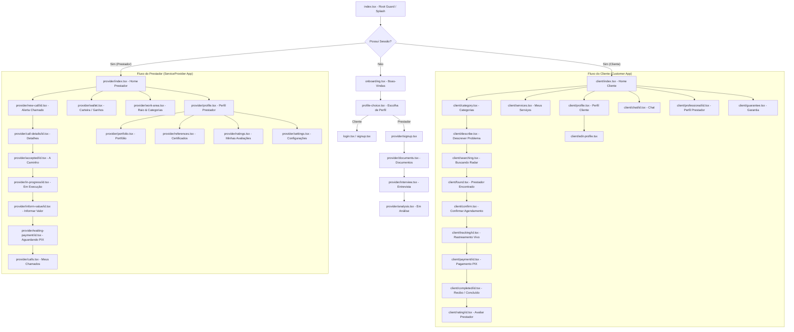

# WorkEz — Especificação Completa de Design & Protótipo para Google Stitch

> **Documento de Design de Interface & Protótipo do Aplicativo Mobile WorkEz**  
> **Versão:** 1.0.0  
> **Plataforma Alvo:** Mobile App (iOS & Android via React Native / Expo 54)  
> **Target de Prototipagem:** Google Stitch / Stitch AI Prototype Generator  
> **Paleta de Cores Dominante:** Light & Dark Slate (#0F172A / #FFFFFF) com realce Cyan Neon (#26FFF5)  

---

## 1. Visão Geral do Sistema e Conceito de Design

### 1.1 Sobre o WorkEz
O **WorkEz** é uma plataforma marketplace mobile multifuncional que conecta **Clientes (Customers)** que necessitam de serviços domésticos e profissionais urgentes ou agendados (como encanadores, eletricistas, diaristas, pintores, montadores e técnicos) a **Prestadores de Serviço (ServiceProviders)** qualificados e verificados.

### 1.2 Linguagem Visual e Diretrizes de UI/UX
- **Conceito:** Interface ultra-moderna, fluida e limpa, inspirada em aplicativos de mobilidade e delivery (Uber/iFood), combinada com painel financeiro profissional para prestadores.
- **Hierarquia Visual:** Cards elevados com cantos arredondados (`border-radius: 16px`), ícones expressivos (Lucide Icons), tipografia em negrito para chamadas principais e estados de progresso com alta visibilidade.
- **Experiência Dual-Persona:**
  - **Fluxo do Cliente:** Foco em agilidade ("Chamar Agora" em 1 clique), facilidade de descrição de problemas com foto, radar de busca animado, rastreamento em tempo real do prestador e pagamento instantâneo via PIX com AbacatePay.
  - **Fluxo do Prestador:** Foco em produtividade com chave de status Online/Offline, alerta sonoro/modal de novos chamados com cronômetro de aceite, navegação integrada ao local de atendimento, inclusão de valores e gestão de carteira financeira com taxa de comissão de 15%.

---

## 2. Design System & Visual Tokens

### 2.1 Cores (Color Tokens)

| Categoria Token | Nome do Token | Valor Hex | Descrição de Uso |
| :--- | :--- | :--- | :--- |
| **Primary Accent** | `color-primary` | `#26FFF5` | Ciano Neon (Ações primárias, destaque, abas ativas, botões de alta prioridade) |
| **Background (Light)**| `color-bg-light` | `#FFFFFF` | Fundo principal da aplicação em modo claro |
| **Background Alt** | `color-bg-alt` | `#F1F5F9` | Fundo secundário (Slate 100) para áreas de contraste e modais |
| **Card Surface** | `color-surface` | `#FFFFFF` | Superfície de cards com borda suave |
| **Text Primary** | `color-text-main` | `#0F172A` | Slate 900 (Títulos, textos principais, botões escuros) |
| **Text Secondary** | `color-text-muted`| `#94A3B8` | Slate 400 (Subtítulos, descrições, placeholders, rótulos) |
| **Border Color** | `color-border` | `#E2E8F0` | Slate 200 (Bordas de cards, divisores e inputs) |
| **Success Status** | `color-success` | `#10B981` | Emerald 500 (Serviço concluído, pagamento confirmado, online) |
| **Warning Status** | `color-warning` | `#FBBF24` | Amber 400 (Pendente, em análise, avaliação com estrelas) |
| **Danger Status** | `color-danger` | `#EF4444` | Red 500 (Cancelado, recusado, erros, zona de perigo) |
| **Info / Progress** | `color-info` | `#2563EB` | Blue 600 (Em andamento, prestador a caminho, links) |

#### Cores Temáticas por Categoria de Serviço
- **Encanador:** Ícone Azul `#3B82F6` | Fundo Card `#EFF6FF`
- **Eletricista:** Ícone Amarelo `#EAB308` | Fundo Card `#FEFCE8`
- **Diarista:** Ícone Roxo `#A855F7` | Fundo Card `#FAF5FF`
- **Pintor:** Ícone Verde `#22C55E` | Fundo Card `#F0FDF4`
- **Montador:** Ícone Laranja `#F97316` | Fundo Card `#FFF7ED`
- **Técnico:** Ícone Vermelho `#EF4444` | Fundo Card `#FEF2F2`

---

### 2.2 Tipografia (Typography System)

| Nível | Tamanho (px) | Altura Linha (px) | Peso | Aplicação Principal |
| :--- | :--- | :--- | :--- | :--- |
| **Display / H1** | 30px | 36px | Bold (700) | Boas-vindas, Títulos Principais de Onboarding |
| **Heading / H2** | 24px | 32px | Bold (700) | Títulos de Telas, Nomes de Prestadores, Valores PIX |
| **Subheading / H3**| 20px | 28px | SemiBold (600) | Títulos de Seção, Nomes de Categorias, Modais |
| **Body Large** | 18px | 28px | Medium (500) | Destaques de Cartões, Subtítulos de Seção |
| **Body Regular** | 16px | 24px | Regular (400) | Textos explicativos, parágrafos, valores de input |
| **Caption** | 14px | 20px | Regular (400) | Datas, endereços secundários, rótulos de campos |
| **Micro / Badge** | 12px | 16px | Medium (500) | Badges de status, tags, contador de tempo |

---

### 2.3 Espaçamento, Bordas e Sombras

- **Grid de Margens/Padding:** `xs: 4px`, `sm: 8px`, `md: 16px`, `lg: 24px`, `xl: 32px`
- **Raio de Curvatura (Border Radius):**
  - Botões / Inputs / Cards: `16px` (`rounded-2xl`)
  - Badges / Tags / Avatares: `9999px` (`rounded-full`)
  - Modais / Bottom Sheets: `24px` (`rounded-t-3xl`)
- **Sombras (Shadows/Elevation):** Soft Card Elevation (`shadowColor: "#000", shadowOffset: { width: 0, height: 4 }, shadowOpacity: 0.05, shadowRadius: 10, elevation: 3`)

---

## 3. Biblioteca de Componentes Recorrentes (Core UI Library)

1. **`Button`**:
   - *Primary:* Fundo Cyan `#26FFF5`, Texto Escuro `#0F172A`, Font Bold, Radius 16px.
   - *Secondary:* Fundo Slate 100 `#F1F5F9`, Texto Slate 900 `#0F172A`.
   - *Ghost / Danger:* Fundo Transparente ou Vermelho Claro, Texto Vermelho `#EF4444`.
2. **`Input`**:
   - Container com ícone prepended (ex: Search, Mail, Lock), borda Slate 200, fundo Branco, focus com brilho Ciano `#26FFF5`.
3. **`ServiceCard`**:
   - Card retangular com ícone da categoria, título da categoria, resumo da solicitação, badge pill de status no canto superior direito e rodapé com data/hora.
4. **`ProfessionalCard`**:
   - Card de prestador com foto de perfil em avatar circular, badge "Verificado" em azul, estrelas de avaliação (`4.9 ★`), total de serviços concluídos, distância em km e valor estimado.
5. **`Badge`**:
   - Cápsula com fundo transparente colorido (10% opacidade) + texto em cor sólida da categoria/status (ex: `Pendente` laranja, `Em andamento` azul, `Concluído` ciano/verde).
6. **`BottomNav` (Barra de Navegação Inferior)**:
   - Fixa na parte inferior com Blur/Superfície Branca, 3 a 4 ícones com indicação de tela ativa em Ciano `#26FFF5` e rótulo explicativo.

---

## 4. Arquitetura de Informação & Diagrama de Navegação

---

## 5. Especificação Detalhada de TODAS as Telas do Projeto (49 Telas)

---

### GRUPO 1: Entrada, Onboarding & Autenticação (9 Telas)

#### 1.1 Tela: Splash & Root Guard
- **Identificador Stitch:** `SCREEN_ROOT_SPLASH`
- **Rota no App:** `app/index.tsx`
- **Persona / Acesso:** Público / Não autenticado
- **Layout & Composição Visual:**
  - Fundo sólido escuro `#0F172A`.
  - Logotipo WorkEz centralizado (Branding com chave de fenda sutil + letra estilizada em Ciano `#26FFF5`).
  - Indicador de carregamento (`ActivityIndicator` Ciano) na parte inferior.
- **Ações & Transição:**
  - Redireciona automaticamente em 1.5s para `app/onboarding.tsx` (se novo usuário) ou `app/client/index.tsx` / `app/provider/index.tsx` (se autenticado).

#### 1.2 Tela: Onboarding & Boas-Vindas
- **Identificador Stitch:** `SCREEN_ONBOARDING`
- **Rota no App:** `app/onboarding.tsx`
- **Persona / Acesso:** Visitante / Novo Usuário
- **Layout & Composição Visual:**
  - Carrossel horizontal de 3 slides com ilustrações modernas e limpas:
    - *Slide 1:* "Serviços na Palma da Sua Mão" — Encontre profissionais qualificados em minutos.
    - *Slide 2:* "Acompanhe em Tempo Real" — Saiba exatamente quando o profissional está a caminho.
    - *Slide 3:* "Pagamento Seguro via PIX" — Pague apenas quando o serviço for concluído com sucesso.
  - Indicador de paginação por pontinhos (dots em Ciano `#26FFF5`).
  - Botão Primário inferior: `Começar Agora` (direciona para escolha de perfil).
- **Ações & Transição:**
  - Clique em `Começar Agora` $\rightarrow$ Navega para `app/profile-choice.tsx`.

#### 1.3 Tela: Seleção de Perfil (Escolha de Role)
- **Identificador Stitch:** `SCREEN_PROFILE_CHOICE`
- **Rota no App:** `app/profile-choice.tsx`
- **Persona / Acesso:** Visitante
- **Layout & Composição Visual:**
  - Cabeçalho: "Como você deseja utilizar o WorkEz?" com subtítulo explicativo.
  - **Card 1 (Cliente):** Ícone grande de usuário/casa, título "Quero contratar serviços", descrição "Procuro profissionais para resolver problemas na minha residência ou empresa". Borda destacada ao selecionar.
  - **Card 2 (Prestador):** Ícone grande de maleta/ferramentas, título "Quero prestar serviços", descrição "Sou um profissional autônomo e quero encontrar novos clientes na minha região".
  - Botão de confirmação inferior: `Continuar`.
- **Ações & Transição:**
  - Selecionar Cliente + `Continuar` $\rightarrow$ `app/login.tsx`.
  - Selecionar Prestador + `Continuar` $\rightarrow$ `app/provider/signup.tsx`.

#### 1.4 Tela: Login de Usuário
- **Identificador Stitch:** `SCREEN_LOGIN`
- **Rota no App:** `app/login.tsx`
- **Persona / Acesso:** Visitante / Cliente / Prestador
- **Layout & Composição Visual:**
  - Logo WorkEz no topo.
  - Título: "Bem-vindo de volta".
  - Formulário:
    - Campo `E-mail` (Input com ícone Mail `#64748B`, placeholder `seu.email@exemplo.com`).
    - Campo `Senha` (Input com ícone Lock `#64748B`, botão de alternar visibilidade de senha).
  - Link à direita: "Esqueceu a senha?".
  - Botão Primário: `Entrar` (Cor Ciano `#26FFF5`, Texto Escuro).
  - Divisor "ou continue com".
  - Link inferior: "Não tem uma conta? Cadastre-se".
- **Ações & Transição:**
  - Clique `Entrar` $\rightarrow$ Valida JWT e navega para `app/client/index.tsx` ou `app/provider/index.tsx`.
  - Clique `Cadastre-se` $\rightarrow$ Navega para `app/signup.tsx` ou `app/profile-choice.tsx`.

#### 1.5 Tela: Cadastro de Cliente
- **Identificador Stitch:** `SCREEN_CLIENT_SIGNUP`
- **Rota no App:** `app/signup.tsx`
- **Persona / Acesso:** Novo Cliente
- **Layout & Composição Visual:**
  - Botão de voltar no topo esquerdo ($\leftarrow$).
  - Título: "Crie sua conta de Cliente".
  - Campos do formulário:
    - `Nome Completo` (Input text).
    - `E-mail` (Input email).
    - `CPF` (Input com máscara `000.000.000-00`).
    - `Telefone / WhatsApp` (Input com máscara `(00) 00000-0000`).
    - `Senha` (Input password com indicador de força).
    - `Confirmar Senha`.
  - Checkbox: "Li e aceito os Termos de Uso e Política de Privacidade".
  - Botão Primário: `Criar Conta`.
- **Ações & Transição:**
  - Clique `Criar Conta` $\rightarrow$ Efetua registro e navega para `app/client/index.tsx`.

#### 1.6 Tela: Cadastro de Prestador (Passo 1: Dados Pessoais)
- **Identificador Stitch:** `SCREEN_PROVIDER_SIGNUP`
- **Rota no App:** `app/provider/signup.tsx`
- **Persona / Acesso:** Novo Prestador
- **Layout & Composição Visual:**
  - Barra de progresso superior: Passo 1 de 3 (33%).
  - Título: "Seus dados profissionais".
  - Campos:
    - `Nome Completo / Razão Social`.
    - `CPF ou CNPJ`.
    - `E-mail profissional`.
    - `Telefone de contato`.
    - `Categoria Principal` (Dropdown seletor: Encanador, Eletricista, Diarista, Pintor, Montador, Técnico).
    - `Senha` e `Confirmação`.
  - Botão Primário: `Avançar para Documentos`.
- **Ações & Transição:**
  - Clique `Avançar` $\rightarrow$ Navega para `app/provider/documents.tsx`.

#### 1.7 Tela: Cadastro de Prestador (Passo 2: Upload de Documentos)
- **Identificador Stitch:** `SCREEN_PROVIDER_DOCUMENTS`
- **Rota no App:** `app/provider/documents.tsx`
- **Persona / Acesso:** Novo Prestador (Passo 2)
- **Layout & Composição Visual:**
  - Barra de progresso: Passo 2 de 3 (66%).
  - Título: "Envio de Documentação".
  - Subtítulo: "Para garantir a segurança dos clientes, precisamos validar seus documentos".
  - **Box 1 (Documento com Foto):** Upload de RG ou CNH (Frente e Verso). Ícone de câmera + preview da imagem enviada.
  - **Box 2 (Comprovante de Residência):** Upload de conta recente.
  - **Box 3 (Selfie de Identificação):** Foto segurando o documento.
  - Botão Primário: `Enviar e Continuar`.
- **Ações & Transição:**
  - Upload via ImgBB e clique `Continuar` $\rightarrow$ Navega para `app/provider/interview.tsx`.

#### 1.8 Tela: Cadastro de Prestador (Passo 3: Entrevista/Validação)
- **Identificador Stitch:** `SCREEN_PROVIDER_INTERVIEW`
- **Rota no App:** `app/provider/interview.tsx`
- **Persona / Acesso:** Novo Prestador (Passo 3)
- **Layout & Composição Visual:**
  - Barra de progresso: Passo 3 de 3 (100%).
  - Título: "Validação de Perfil & Experiência".
  - Questionário rápido de 3 perguntas:
    1. *Anos de experiência no ramo:* (Selector: Menos de 1 ano, 1-3 anos, 3-5 anos, 5+ anos).
    2. *Possui ferramentas próprias?* (Sim / Não).
    3. *Descreva resumidamente suas principais especialidades.* (Textarea).
  - Botão Primário: `Finalizar Cadastro`.
- **Ações & Transição:**
  - Clique `Finalizar` $\rightarrow$ Navega para `app/provider/analysis.tsx`.

#### 1.9 Tela: Conta de Prestador em Análise
- **Identificador Stitch:** `SCREEN_PROVIDER_ANALYSIS`
- **Rota no App:** `app/provider/analysis.tsx`
- **Persona / Acesso:** Prestador Pendente de Aprovação
- **Layout & Composição Visual:**
  - Ilustração central de escudo com relógio de checagem.
  - Título: "Perfil em Análise".
  - Descrição: "Nossa equipe está verificando seus documentos e informações. Este processo costuma levar até 24 horas úteis."
  - Card Informativo: Status `Pendente de Aprovação` (Badge Amarelo `#FBBF24`).
  - Botão Secundário: `Verificar Novamente` / `Contactar Suporte`.
- **Ações & Transição:**
  - Quando aprovado pela API $\rightarrow$ Redireciona para `app/provider/index.tsx`.

---

### GRUPO 2: Fluxo do Cliente - Solicitação & Acompanhamento (18 Telas)

#### 2.1 Tela: Home do Cliente (Tab 1)
- **Identificador Stitch:** `SCREEN_CLIENT_HOME`
- **Rota no App:** `app/client/index.tsx`
- **Persona / Acesso:** Cliente Autenticado
- **Layout & Composição Visual:**
  - **Header Superior:** "Olá, [Nome]! 👋" + Subtítulo "Qual serviço você precisa hoje?".
  - **Barra de Busca:** Input arredondado com ícone de lupa, filtro e placeholder "Buscar serviços...".
  - **Botão CTA em Destaque:** Banner principal `Chamar agora` com ícone de raio Ciano `#26FFF5` e texto em destaque.
  - **Grid de Categorias (2 colunas):** Cards coloridos interativos:
    - *Encanador* (Ícone Wrench Azul)
    - *Eletricista* (Ícone Zap Amarelo)
    - *Diarista* (Ícone Brush Roxo)
    - *Pintor* (Ícone Paintbrush Verde)
    - *Montador* (Ícone Hammer Laranja)
    - *Técnico* (Ícone Settings Vermelho)
  - **Seção "Por que escolher o WorkEz?":** 3 Cards com os benefícios: Profissionais Verificados, Pagamento Seguro e Avaliações Reais.
  - **Barra de Navegação Inferior (BottomNav):** Início (Ativo), Meus Serviços, Perfil.
- **Ações & Transição:**
  - Clique em `Chamar agora` $\rightarrow$ `app/client/category.tsx`.
  - Clique em Categoria $\rightarrow$ `app/client/describe.tsx` (passando a categoria escolhida).
  - Clique em Aba `Meus Serviços` $\rightarrow$ `app/client/services.tsx`.
  - Clique em Aba `Perfil` $\rightarrow$ `app/client/profile.tsx`.

#### 2.2 Tela: Seleção de Categoria de Serviço
- **Identificador Stitch:** `SCREEN_CLIENT_CATEGORY_SELECT`
- **Rota no App:** `app/client/category.tsx`
- **Persona / Acesso:** Cliente
- **Layout & Composição Visual:**
  - Header com botão de voltar ($\leftarrow$) e título "Escolha a Categoria".
  - Lista vertical de cards estendidos para cada categoria com nome, ícone grande, descrição dos serviços inclusos e seta indicador ($\rightarrow$).
- **Ações & Transição:**
  - Clique em qualquer categoria $\rightarrow$ `app/client/describe.tsx?category=[nome]`.

#### 2.3 Tela: Descrição do Problema / Solicitação de Serviço
- **Identificador Stitch:** `SCREEN_CLIENT_DESCRIBE`
- **Rota no App:** `app/client/describe.tsx`
- **Persona / Acesso:** Cliente
- **Layout & Composição Visual:**
  - Header: "Descreva o Serviço" (com badge da categoria selecionada).
  - **Campo Textarea:** "Descreva o que precisa ser feito..." (mínimo de detalhes, placeholder com exemplo prático ex: "Vazamento na torneira da cozinha").
  - **Seção de Fotos/Mídia:** Botão "+ Adicionar Fotos do Problema" (suporta envio de imagens para o ImgBB com miniaturas em grid).
  - **Seção de Endereço:** Card com endereço atual detectado via CEP/GPS + botão "Alterar endereço".
  - **Opção de Urgência:** Toggle/Radio "Preciso para agora" vs "Agendar horário".
  - Botão Primário Inferior: `Buscar Prestadores Disponíveis`.
- **Ações & Transição:**
  - Clique `Buscar Prestadores` $\rightarrow$ Cria `Service` na API com status `Open` e navega para `app/client/searching.tsx`.

#### 2.4 Tela: Radar de Busca de Prestadores
- **Identificador Stitch:** `SCREEN_CLIENT_SEARCHING`
- **Rota no App:** `app/client/searching.tsx`
- **Persona / Acesso:** Cliente
- **Layout & Composição Visual:**
  - Animação de radar pulsante circular Ciano `#26FFF5` com mapa de fundo em tom escuro sutil.
  - Título central: "Procurando profissionais próximos...".
  - Subtítulo: "Enviando sua solicitação para encanadores em um raio de 10 km".
  - Card de status na parte inferior: "Tempo estimado de resposta: < 2 min".
  - Botão de cancelamento discreto: `Cancelar Solicitação`.
- **Ações & Transição:**
  - Quando um prestador aceita na API $\rightarrow$ Transição automática para `app/client/found.tsx`.
  - Clique `Cancelar` $\rightarrow$ `app/cancel/[id].tsx`.

#### 2.5 Tela: Prestador Encontrado / Proposta Aceita
- **Identificador Stitch:** `SCREEN_CLIENT_FOUND`
- **Rota no App:** `app/client/found.tsx`
- **Persona / Acesso:** Cliente
- **Layout & Composição Visual:**
  - Banner de sucesso superior: "Profissional Encontrado! 🎉".
  - **Card do Prestador (`ProfessionalCard`):**
    - Avatar circular, Nome (ex: "Carlos Silva"), Badge "Verificado", Nota `4.9 ★ (42 avaliações)`.
    - Distância: `2.4 km de você (chegada em aprox. 15 min)`.
    - Valor Estimado / Visita: `R$ 150,00`.
  - Botão de Ação Primária: `Confirmar e Acompanhar Prestador`.
  - Botão Secundário: `Ver Perfil Completo do Profissional`.
- **Ações & Transição:**
  - Clique `Confirmar` $\rightarrow$ `app/client/tracking/[id].tsx`.
  - Clique `Ver Perfil` $\rightarrow$ `app/client/professional/[id].tsx`.

#### 2.6 Tela: Confirmação do Agendamento / Chamado
- **Identificador Stitch:** `SCREEN_CLIENT_CONFIRM`
- **Rota no App:** `app/client/confirm.tsx`
- **Persona / Acesso:** Cliente
- **Layout & Composição Visual:**
  - Card de Resumo do Chamado:
    - Categoria e Descrição do serviço.
    - Endereço de atendimento completo.
    - Data/Hora agendada ou "Atendimento Imediato".
    - Dados do Prestador Atribuído.
  - Botão Primário: `Confirmar Solicitacão`.
- **Ações & Transição:**
  - Clique `Confirmar` $\rightarrow$ Redireciona para `app/client/tracking/[id].tsx`.

#### 2.7 Tela: Rastreamento em Tempo Real do Prestador
- **Identificador Stitch:** `SCREEN_CLIENT_TRACKING`
- **Rota no App:** `app/client/tracking/[id].tsx`
- **Persona / Acesso:** Cliente
- **Layout & Composição Visual:**
  - **Mapa Interativo (Fundo Topo 60%):** Exibição do pino do Cliente e o marcador em movimento do Prestador com rota destacada em Ciano `#26FFF5`.
  - **Bottom Sheet de Status (Inferior 40%):**
    - Indicador de Status Atual: Badge `A Caminho` (Azul) / `Serviço em Andamento` (Verde).
    - Avatar, Nome e Categoria do Prestador.
    - Botões rápidos de comunicação: Ícone de Telefone / Ícone de Chat com badge de mensagens não lidas.
    - Botão de Emergência / Suporte: `Acionar Garantia WorkEz`.
- **Ações & Transição:**
  - Clique Ícone de Chat $\rightarrow$ `app/client/chat/[id].tsx`.
  - Clique `Acionar Garantia` $\rightarrow$ `app/activate-guarantee/[id].tsx`.
  - Quando o prestador conclui e informa o valor $\rightarrow$ Transição para `app/client/payment/[id].tsx`.

#### 2.8 Tela: Pagamento via PIX (AbacatePay)
- **Identificador Stitch:** `SCREEN_CLIENT_PAYMENT`
- **Rota no App:** `app/client/payment/[id].tsx`
- **Persona / Acesso:** Cliente
- **Layout & Composição Visual:**
  - Header: "Pagamento do Serviço".
  - **Card de Valor:** Destaque em texto grande `R$ 150,00` em verde/ciano.
  - Subtítulo: "Escaneie o QR Code PIX ou utilize o Copia e Cola".
  - **Box QR Code:** Imagem do QR Code PIX gerado via AbacatePay centralizada com moldura branca e sombra.
  - **Campo PIX Copia e Cola:** Input de texto somente leitura com código hash PIX e botão lateral em destaque `Copiar Código PIX`.
  - Indicador de Polling: "Aguardando confirmação do pagamento..." com spinner discreto.
  - Botão Secundário: `Já realizei o pagamento`.
- **Ações & Transição:**
  - Webhook/Polling confirma o pagamento PIX $\rightarrow$ Redireciona automaticamente para `app/client/completed/[id].tsx`.

#### 2.9 Tela: Recibo & Serviço Concluído
- **Identificador Stitch:** `SCREEN_CLIENT_COMPLETED`
- **Rota no App:** `app/client/completed/[id].tsx`
- **Persona / Acesso:** Cliente
- **Layout & Composição Visual:**
  - Animação de Checkmark de Sucesso Verde `#10B981`.
  - Título: "Serviço Concluído com Sucesso!".
  - **Card de Recibo:**
    - Número do Chamado: `#WEZ-84920`.
    - Prestador: Carlos Silva (Encanador).
    - Valor Pago: `R$ 150,00` (Método: PIX - AbacatePay).
    - Data/Hora de Término.
  - Botão Primário: `Avaliar o Prestador`.
  - Botão Secundário: `Voltar ao Início`.
- **Ações & Transição:**
  - Clique `Avaliar` $\rightarrow$ `app/client/rating/[id].tsx`.
  - Clique `Voltar` $\rightarrow$ `app/client/index.tsx`.

#### 2.10 Tela: Avaliação do Prestador
- **Identificador Stitch:** `SCREEN_CLIENT_RATING`
- **Rota no App:** `app/client/rating/[id].tsx`
- **Persona / Acesso:** Cliente
- **Layout & Composição Visual:**
  - Header com foto e nome do prestador avaliado.
  - Título: "Como foi sua experiência com Carlos Silva?".
  - **Seletor de Estrelas (Interactive 5 Stars):** Estrelas grandes em Amarelo `#FBBF24` (Selecione 1 a 5 estrelas).
  - **Tags Rápidas de Feedback:** Chips selecionáveis (ex: "Pontual", "Educado", "Serviço Limpo", "Preço Justo", "Excelente Trabalho").
  - **Campo de Comentário:** Textarea com placeholder "Escreva um comentário opcional...".
  - Botão Primário: `Enviar Avaliação`.
- **Ações & Transição:**
  - Clique `Enviar` $\rightarrow$ Envia avaliação para API e navega para `app/client/index.tsx`.

#### 2.11 Tela: Meus Serviços (Tab 2 do Cliente)
- **Identificador Stitch:** `SCREEN_CLIENT_SERVICES_LIST`
- **Rota no App:** `app/client/services.tsx`
- **Persona / Acesso:** Cliente
- **Layout & Composição Visual:**
  - Header: "Meus Serviços".
  - **Abas Superiores (Segmented Control):** `Em Andamento` | `Concluídos` | `Cancelados`.
  - **Lista Vertical de `ServiceCard`s:**
    - Exibe cada serviço com badge de status colorido (`Pendente`, `A caminho`, `Em andamento`, `Concluído`, `Cancelado`), nome do profissional (se houver), categoria, data e botão de detalhes.
  - Estado Vazio (Empty State): Ilustração simples + "Você não possui chamados nesta categoria" + botão `Solicitar Serviço`.
- **Ações & Transição:**
  - Clique em Card de serviço em andamento $\rightarrow$ `app/client/tracking/[id].tsx`.
  - Clique em Card de serviço concluído $\rightarrow$ `app/client/completed/[id].tsx`.

#### 2.12 Tela: Chat em Tempo Real (Visão Cliente)
- **Identificador Stitch:** `SCREEN_CLIENT_CHAT`
- **Rota no App:** `app/client/chat/[id].tsx`
- **Persona / Acesso:** Cliente
- **Layout & Composição Visual:**
  - Header com botão de voltar, foto do Prestador, Nome e indicador "Online".
  - **Área de Mensagens Scrollável:**
    - Balões de mensagem do Cliente à direita (Fundo Ciano `#26FFF5`, Texto Escuro `#0F172A`).
    - Balões de mensagem do Prestador à esquerda (Fundo Slate 100 `#F1F5F9`, Texto Slate 900).
    - Timestamp em formato `14:32`.
  - **Barra de Entrada de Texto Inferior:** Input com ícone de clipe para anexar fotos e botão de enviar ícone Send Ciano.
- **Ações & Transição:**
  - Digitar mensagem + clique `Enviar` $\rightarrow$ Atualiza chat em tempo real via WebSocket/API.

#### 2.13 Tela: Perfil Público do Prestador
- **Identificador Stitch:** `SCREEN_CLIENT_PROFESSIONAL_PROFILE`
- **Rota no App:** `app/client/professional/[id].tsx`
- **Persona / Acesso:** Cliente
- **Layout & Composição Visual:**
  - Header com capa e foto de perfil grande com badge de "Verificado".
  - Nome do Prestador, Categoria Principal, Nota Média (`4.9 ★`) e total de trabalhos realizados.
  - **Sessão Bio:** Resumo da experiência profissional.
  - **Sessão Portfólio:** Carrossel de fotos de trabalhos anteriores (ex: fotos de instalações elétricas/hidráulicas concluídas).
  - **Sessão de Avaliações de Clientes:** Lista de `RatingCard`s com estrelas e depoimentos reais.
  - Botão Primário Fixo Inferior: `Solicitar Serviço com este Profissional`.
- **Ações & Transição:**
  - Clique `Solicitar Serviço` $\rightarrow$ `app/client/describe.tsx`.

#### 2.14 Tela: Prestadores Favoritos
- **Identificador Stitch:** `SCREEN_CLIENT_FAVORITES`
- **Rota no App:** `app/client/favorites.tsx`
- **Persona / Acesso:** Cliente
- **Layout & Composição Visual:**
  - Header: "Profissionais Favoritos".
  - Lista de `ProfessionalCard`s salvos pelo cliente com ícone de coração vermelho preenchido.
- **Ações & Transição:**
  - Clique no card $\rightarrow$ `app/client/professional/[id].tsx`.

#### 2.15 Tela: Métodos de Pagamento Salvos
- **Identificador Stitch:** `SCREEN_CLIENT_PAYMENT_METHODS`
- **Rota no App:** `app/client/payment-methods.tsx`
- **Persona / Acesso:** Cliente
- **Layout & Composição Visual:**
  - Header: "Formas de Pagamento".
  - Card Destaque: **PIX Instantâneo** (Método Padrão com Chave/QR Code AbacatePay).
  - Opções adicionais de cartões salvos para consulta.
- **Ações & Transição:**
  - Clique em adicionar método $\rightarrow$ Atualiza dados de pagamento.

#### 2.16 Tela: Informações da Garantia WorkEz
- **Identificador Stitch:** `SCREEN_CLIENT_GUARANTEE_INFO`
- **Rota no App:** `app/client/guarantee.tsx`
- **Persona / Acesso:** Cliente
- **Layout & Composição Visual:**
  - Header com escudo de proteção em destaque.
  - Título: "Garantia de 30 dias WorkEz".
  - Lista de coberturas (Refazer serviço sem custo adicional se houver defeito, suporte prioritário, mediação de conflitos).
- **Ações & Transição:**
  - Clique em `Acionar Garantia em um Serviço` $\rightarrow$ Redireciona para lista de serviços qualificados.

#### 2.17 Tela: Acionar Garantia / Formulário de Suporte
- **Identificador Stitch:** `SCREEN_CLIENT_ACTIVATE_GUARANTEE`
- **Rota no App:** `app/activate-guarantee/[id].tsx`
- **Persona / Acesso:** Cliente
- **Layout & Composição Visual:**
  - Header: "Acionar Garantia do Serviço #WEZ-[ID]".
  - Form: Seleção do problema (ex: "Serviço com defeito", "Dano material", "Prestador não concluiu"), Textarea de detalhes e upload de fotos de evidência.
  - Botão Primário: `Enviar Solicitação de Garantia`.
- **Ações & Transição:**
  - Clique `Enviar` $\rightarrow$ Registra chamado de garantia e exibe confirmação.

#### 2.18 Tela: Cancelamento de Serviço
- **Identificador Stitch:** `SCREEN_CANCEL_SERVICE`
- **Rota no App:** `app/cancel/[id].tsx`
- **Persona / Acesso:** Cliente / Prestador
- **Layout & Composição Visual:**
  - Header: "Cancelar Chamado".
  - Lista de motivos de cancelamento com Radio Buttons (ex: "Desisti do serviço", "Demora do prestador", "Encontrei outra solução").
  - Aviso de política de cancelamento.
  - Botão Danger: `Confirmar Cancelamento`.
- **Ações & Transição:**
  - Clique `Confirmar` $\rightarrow$ Cancela chamado no backend e retorna à Home.

---

### GRUPO 3: Fluxo do Cliente - Perfil & Edição (2 Telas)

#### 3.1 Tela: Perfil do Cliente (Tab 3)
- **Identificador Stitch:** `SCREEN_CLIENT_PROFILE`
- **Rota no App:** `app/client/profile.tsx`
- **Persona / Acesso:** Cliente
- **Layout & Composição Visual:**
  - Header com Avatar grande do cliente, Nome, E-mail e badge "Cliente WorkEz".
  - **Menu de Opções (Lista de Itens com Ícones):**
    - `Editar Perfil` (Ícone User)
    - `Meus Favoritos` (Ícone Heart)
    - `Formas de Pagamento` (Ícone CreditCard)
    - `Garantia WorkEz` (Ícone ShieldCheck)
    - `Central de Ajuda & Suporte` (Ícone HelpCircle)
    - `Sair da Conta` (Ícone LogOut em Vermelho)
- **Ações & Transição:**
  - Clique `Editar Perfil` $\rightarrow$ `app/client/edit-profile.tsx`.
  - Clique `Sair` $\rightarrow$ Limpa token JWT e navega para `app/login.tsx`.

#### 3.2 Tela: Editar Perfil do Cliente
- **Identificador Stitch:** `SCREEN_CLIENT_EDIT_PROFILE`
- **Rota no App:** `app/client/edit-profile.tsx`
- **Persona / Acesso:** Cliente
- **Layout & Composição Visual:**
  - Header com botão de voltar e foto com ícone de câmera para alteração.
  - Campos: Nome, E-mail, Telefone, Endereço Principal.
  - Botão Primário: `Salvar Alterações`.
- **Ações & Transição:**
  - Clique `Salvar` $\rightarrow$ Atualiza perfil na API.

---

### GRUPO 4: Fluxo do Prestador - Oportunidades & Carteira (16 Telas)

#### 4.1 Tela: Home do Prestador / Painel de Oportunidades (Tab 1)
- **Identificador Stitch:** `SCREEN_PROVIDER_HOME`
- **Rota no App:** `app/provider/index.tsx`
- **Persona / Acesso:** Prestador Autenticado
- **Layout & Composição Visual:**
  - **Header Superior:**
    - Nome do Prestador + Badge "Verificado".
    - **Switch Toggle de Status Online/Offline:** Botão com indicação luminosa (Verde `#10B981` quando "Online - Recebendo Chamados").
  - **Card de Resumo Financeiro do Dia:** Saldo Acumulado no dia (ex: `R$ 450,00`) + Total de Atendimentos.
  - **Seção "Chamados Disponíveis Próximos":**
    - Lista de cards de oportunidades abertas na região (ex: "Vazamento em Banheiro - 3.1 km - Estimado R$ 150,00").
  - **Barra de Navegação Inferior (BottomNav Prestador):** Oportunidades (Ativo), Meus Chamados, Carteira, Perfil.
- **Ações & Transição:**
  - Clique em Oportunidade $\rightarrow$ `app/provider/call-details/[id].tsx`.
  - Clique em Aba `Carteira` $\rightarrow$ `app/provider/wallet.tsx`.

#### 4.2 Tela: Alerta de Novo Chamado Recebido (Modal Pop-up)
- **Identificador Stitch:** `SCREEN_PROVIDER_NEW_CALL_ALERT`
- **Rota no App:** `app/provider/new-call/[id].tsx`
- **Persona / Acesso:** Prestador
- **Layout & Composição Visual:**
  - Modal sobreposto com borda Ciano `#26FFF5` pulsante e som de alerta.
  - **Timer Regressivo:** Anel circular de 30 segundos para resposta.
  - Categoria e Distância do Cliente (ex: `Encanador - A 2.5 km de você`).
  - Descrição resumida do problema e fotos anexadas.
  - Botão Primário Grande: `Aceitar Chamado Agora`.
  - Botão Secundário: `Recusar`.
- **Ações & Transição:**
  - Clique `Aceitar` $\rightarrow$ Executa `POST /api/services/{id}/accept` e navega para `app/provider/accepted/[id].tsx`.

#### 4.3 Tela: Detalhes do Chamado Disponível
- **Identificador Stitch:** `SCREEN_PROVIDER_CALL_DETAILS`
- **Rota no App:** `app/provider/call-details/[id].tsx`
- **Persona / Acesso:** Prestador
- **Layout & Composição Visual:**
  - Header: "Detalhes da Solicitação #WEZ-[ID]".
  - Mapa aproximado com bairro/região do atendimento.
  - Fotos do problema enviadas pelo cliente.
  - Descrição completa do problema.
  - Botão Primário: `Aceitar este Chamado (R$ 150,00)`.
- **Ações & Transição:**
  - Clique `Aceitar` $\rightarrow$ `app/provider/accepted/[id].tsx`.

#### 4.4 Tela: Chamado Aceito / Prestador a Caminho
- **Identificador Stitch:** `SCREEN_PROVIDER_ACCEPTED`
- **Rota no App:** `app/provider/accepted/[id].tsx`
- **Persona / Acesso:** Prestador
- **Layout & Composição Visual:**
  - Mapa com rota de navegação GPS até o endereço liberado do cliente.
  - Bottom Card: Nome do Cliente, Endereço Completo, Botão de Ligar / Chat.
  - Botão Primário em Destaque: `Cheguei ao Local do Cliente`.
- **Ações & Transição:**
  - Clique `Cheguei` $\rightarrow$ Atualiza status para `InProgress` e navega para `app/provider/in-progress/[id].tsx`.

#### 4.5 Tela: Serviço em Andamento (Execução)
- **Identificador Stitch:** `SCREEN_PROVIDER_IN_PROGRESS`
- **Rota no App:** `app/provider/in-progress/[id].tsx`
- **Persona / Acesso:** Prestador
- **Layout & Composição Visual:**
  - Status: Badge Azul `Em Execução`.
  - Cronômetro de tempo de serviço decorrido (`00:42:15`).
  - Lista de verificação do serviço.
  - Botão Primário: `Concluir Serviço e Informar Valor`.
- **Ações & Transição:**
  - Clique `Concluir` $\rightarrow$ `app/provider/inform-value/[id].tsx`.

#### 4.6 Tela: Informar Valor Final do Serviço
- **Identificador Stitch:** `SCREEN_PROVIDER_INFORM_VALUE`
- **Rota no App:** `app/provider/inform-value/[id].tsx`
- **Persona / Acesso:** Prestador
- **Layout & Composição Visual:**
  - Header: "Finalização do Atendimento".
  - **Campo de Valor (Input R$):** Digite o valor final cobrado (ex: `150.00`).
  - Campo opcional: Descrição dos materiais utilizados / justificativa de peças.
  - Card Informativo:
    - Valor total: `R$ 150,00`
    - Taxa da plataforma WorkEz (15%): `R$ 22,50`
    - Seu ganho líquido: `R$ 127,50`
  - Botão Primário: `Gerar Cobrança PIX para o Cliente`.
- **Ações & Transição:**
  - Clique `Gerar Cobrança` $\rightarrow$ Executa `PATCH /complete?price=` na API e navega para `app/provider/waiting-payment/[id].tsx`.

#### 4.7 Tela: Aguardando Pagamento PIX do Cliente
- **Identificador Stitch:** `SCREEN_PROVIDER_WAITING_PAYMENT`
- **Rota no App:** `app/provider/waiting-payment/[id].tsx`
- **Persona / Acesso:** Prestador
- **Layout & Composição Visual:**
  - Spinner de carregamento + ícone PIX.
  - Título: "Cobrança PIX enviada ao cliente!".
  - Subtítulo: "Aguardando o cliente efetuar o pagamento de R$ 150,00 no aplicativo".
  - Notificação sonora ao confirmar pagamento.
- **Ações & Transição:**
  - Quando a API confirma pagamento $\rightarrow$ Exibe mensagem de sucesso e redireciona para `app/provider/index.tsx`.

#### 4.8 Tela: Meus Chamados do Prestador (Tab 2)
- **Identificador Stitch:** `SCREEN_PROVIDER_CALLS_HISTORY`
- **Rota no App:** `app/provider/calls.tsx`
- **Persona / Acesso:** Prestador
- **Layout & Composição Visual:**
  - Header: "Histórico de Atendimentos".
  - Abas: `Em Andamento` | `Concluídos` | `Cancelados`.
  - Lista de chamados atendidos com ganhos líquidos detalhados em cada card.
- **Ações & Transição:**
  - Clique no card $\rightarrow$ Exibe detalhes do atendimento.

#### 4.9 Tela: Chat com o Cliente (Visão Prestador)
- **Identificador Stitch:** `SCREEN_PROVIDER_CHAT`
- **Rota no App:** `app/provider/chat/[id].tsx`
- **Persona / Acesso:** Prestador
- **Layout & Composição Visual:**
  - Interface idêntica ao chat do cliente com balões de mensagem invertidos.
- **Ações & Transição:**
  - Comunicação via WebSocket/API.

#### 4.10 Tela: Carteira Digital & Ganhos (Tab 3 do Prestador)
- **Identificador Stitch:** `SCREEN_PROVIDER_WALLET`
- **Rota no App:** `app/provider/wallet.tsx`
- **Persona / Acesso:** Prestador
- **Layout & Composição Visual:**
  - **Card Destaque de Saldo:**
    - Fundo escuro Slate 900 `#0F172A` com detalhes Ciano `#26FFF5`.
    - Saldo Disponível para Saque: `R$ 1.280,50`.
    - Ganhos Totais do Mês: `R$ 3.450,00`.
    - Comissão Descontada (15%): `R$ 517,50`.
  - Botão Primário: `Solicitar Saque via PIX`.
  - **Extrato Financeiro:** Lista de transações recentes com data, valor bruto, taxa 15% e valor líquido creditado.
- **Ações & Transição:**
  - Clique `Solicitar Saque` $\rightarrow$ Abre modal de confirmação de transferência PIX.

#### 4.11 Tela: Raio de Atuação e Categorias
- **Identificador Stitch:** `SCREEN_PROVIDER_WORK_AREA`
- **Rota no App:** `app/provider/work-area.tsx`
- **Persona / Acesso:** Prestador
- **Layout & Composição Visual:**
  - Header: "Região & Categorias de Atendimento".
  - **Slider de Raio de Atendimento:** Slider ajustável (ex: `10 km`, `15 km`, `25 km`).
  - **Checklist de Categorias Ativas:** Switches para ativar/desativar categorias que o prestador atende.
  - Botão Primário: `Salvar Configurações`.
- **Ações & Transição:**
  - Clique `Salvar` $\rightarrow$ Salva preferências na API.

#### 4.12 Tela: Portfólio de Trabalhos Anteriores
- **Identificador Stitch:** `SCREEN_PROVIDER_PORTFOLIO`
- **Rota no App:** `app/provider/portfolio.tsx`
- **Persona / Acesso:** Prestador
- **Layout & Composição Visual:**
  - Grid 3x3 de fotos de trabalhos concluídos com botão "+ Adicionar Foto ao Portfólio".
- **Ações & Transição:**
  - Upload de fotos via ImgBB.

#### 4.13 Tela: Referências & Certificados
- **Identificador Stitch:** `SCREEN_PROVIDER_REFERENCES`
- **Rota no App:** `app/provider/references.tsx`
- **Persona / Acesso:** Prestador
- **Layout & Composição Visual:**
  - Lista de certificados de cursos técnicos (ex: Curso NR-10 Eletricista, SENAI) anexados ao perfil.

#### 4.14 Tela: Minhas Avaliações (Visão Prestador)
- **Identificador Stitch:** `SCREEN_PROVIDER_RATINGS`
- **Rota no App:** `app/provider/ratings.tsx`
- **Persona / Acesso:** Prestador
- **Layout & Composição Visual:**
  - Resumo de Avaliações: Média `4.9 ★` (Barra de distribuição de 1 a 5 estrelas).
  - Lista de depoimentos recebidos dos clientes com data e categoria do serviço.

#### 4.15 Tela: Perfil do Prestador (Tab 4)
- **Identificador Stitch:** `SCREEN_PROVIDER_PROFILE`
- **Rota no App:** `app/provider/profile.tsx`
- **Persona / Acesso:** Prestador
- **Layout & Composição Visual:**
  - Avatar, Nome, Categoria, Badge "Verificado" e Nota Média.
  - Menu de opções: Editar Perfil, Raio de Atuação, Portfólio, Certificados, Avaliações, Configurações de Saque, Sair.

#### 4.16 Tela: Configurações da Conta do Prestador
- **Identificador Stitch:** `SCREEN_PROVIDER_SETTINGS`
- **Rota no App:** `app/provider/settings.tsx`
- **Persona / Acesso:** Prestador
- **Layout & Composição Visual:**
  - Opções de notificação, alteração de chave PIX de saque (CPF, E-mail, Celular) e segurança.

---

### GRUPO 5: Telas Globais & Utilitários (3 Telas)

#### 5.1 Tela: Central de Ajuda & Suporte
- **Identificador Stitch:** `SCREEN_HELP_SUPPORT`
- **Rota no App:** `app/help.tsx`
- **Persona / Acesso:** Todos
- **Layout & Composição Visual:**
  - Barra de busca de dúvidas frequentes (FAQ).
  - Accordion com perguntas e respostas comuns (Como funciona a garantia, pagamentos, cancelamentos).
  - Botão Primário: `Falar com Suporte via WhatsApp`.

#### 5.2 Tela: Modal Dinâmico Global
- **Identificador Stitch:** `SCREEN_GLOBAL_MODAL`
- **Rota no App:** `app/modal.tsx`
- **Persona / Acesso:** Todos
- **Layout & Composição Visual:**
  - Overlay semi-transparente com cartão centralizado para alertas de confirmação, avisos de sistema e notificações.

#### 5.3 Tela: Visualizador de Tokens do Design System
- **Identificador Stitch:** `SCREEN_DESIGN_TOKENS_PREVIEW`
- **Rota no App:** `app/colors.tsx`
- **Persona / Acesso:** Desenvolvedores / Stitch
- **Layout & Composição Visual:**
  - Display de amostragem de todas as cores da paleta WorkEz, tamanhos de fonte, variações de botões e badges para referência visual direta do Google Stitch.

---

## 6. Instruções de Síntese para o Google Stitch

1. **Geração de Componentes Visuais:** Ao compilar as telas, utilize os tokens definidos na seção 2. Aplique a cor principal Ciano `#26FFF5` como destaque interativo e o tema escuro/claro Slate `#0F172A` para fundos e cartões.
2. **Fidelidade de Fluxo:** Siga o mapa Mermaid da seção 4 para conectar todos os botões e CTAs das telas às suas respectivas rotas de destino no protótipo navegável.
3. **Mocks de Dados:** Utilize nomes brasileiros realistas, endereços com CEPs válidos, valores em Reais (R$) e badges de status coloridas conforme a especificação de cada tela.
